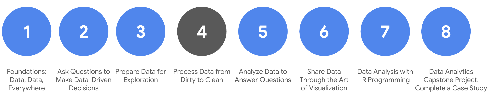

# Course syllabus

1. Foundations: Data, Data, Everywhere
2. Ask Questions to Make Data-Driven Decisions
3. Prepare Data for Exploration  
4. **Process Data from Dirty to Clean** (this course)
5. Analyze Data to Answer Questions
6. Share Data Through the Art of Visualization 
7. Data Analysis with R Programming 
8. Google D​ata Analytics Capstone: Complete a Case Study 

Welcome to the fourth course in the program! As you make your way through the certificate, this course and others that follow will begin to focus more attention on practical, hands-on assignments and projects. This progressively increases the amount of time you have to develop important job skills.

In the last course, you worked on some basic skills you will need as an entry-level data analyst. You learned about data structures, and discovered how to obtain, apply, organize, and protect data. 

In this course, you will learn to make sure your data is clean by checking it for completeness and correctness. You will review a variety of approaches to clean data in spreadsheets and databases. You will also learn how to verify that your data is clean and how to create reports to communicate that information to others. Ensuring the accuracy and reliability of data is a critical part of a data analyst’s job.  

&nbsp;
 
## Course content

C​ourse 4 – Process Data from Dirty to Clean 

1. **E​nsuring data integrity.** Data integrity is necessary to ensure a successful analysis. In this part of the course, you will explore methods and steps that analysts take to check data for integrity. This includes knowing what to do when you have an insufficient amount of data. You will also learn about sample size, avoiding sample bias, and using random samples. All of these measures also help to ensure a successful data analysis.
2. **U​nderstanding clean data.** Every data analyst wants clean data to work with when performing an analysis. In this part of the course, you will learn the difference between clean and dirty data. You will practice data cleaning techniques in spreadsheets and other tools.
3. **C​leaning data using SQL.** Knowing a variety of ways to clean data can make an analyst’s job much easier. In this part of the course, you will use SQL to clean data from databases. You will explore how SQL queries and functions can be used to clean and transform your data before an analysis.
4. **V​erifying and reporting cleaning results.** Cleaning data is an important step in the data analysis process. In this part of the course, you will verify that data is clean and report data cleaning results. With verified clean data, you will be ready for the next step in the data analysis process.
5. **(​Optional) Adding data to your resume.** Creating an effective resume will help you in your data analytics career. In this part of the course, you will learn all about the job application process. Your focus will be on building a resume that highlights your strengths and relevant experience. 
6. **C​ompleting the Course Challenge.** At the end of this course, you will be able to apply what you have learned in the Course Challenge. The Course Challenge will ask you questions about the key concepts and then will give you an opportunity to put them into practice as you go through prepared scenarios.

&nbsp;

## What to expect

This part of the program is designed to get you familiar with different data structures and show you how to collect, apply, organize, and protect data. All of these skills will be part of your daily tasks as an entry-level data analyst. You will work on a wide range of activities that are similar to real-life tasks that data analysts come across on a daily basis.

This course has five modules or weeks, and each has several lessons included. Within each lesson, you will find content such as:

* **V​ideos** of instructors teaching new concepts and demonstrating the use of tools 
* **In-video questions** that pop up during or at the end of a video to check your learning
* **Readings** to introduce new ideas and build on the concepts from the videos
* **Discussion forums** to discuss, explore, and reinforce new ideas for better learning
* **D​iscussion prompts** to promote thinking and engagement in the discussion forums
* **Q​wiklabs** to introduce real-world, on-the-job situations, and the tools and tasks to complete assignments 
* **Practice quizzes** to prepare you for graded quizzes
* **Graded quizzes** to measure your progress and give you valuable feedback 

Hands-on activities promote additional opportunities to build your skills. Try to get as much out of them as possible. Assessments are based on the approach taken by the course to offer a wide variety of learning materials and activities that reinforce important skills. Graded and ungraded quizzes will  help the content sink in. Ungraded practice quizzes are a chance for you to prepare for the graded quizzes. Both types of quizzes can be taken more than one time.

As a quick reminder, this course is designed for all types of learners, with no degree or prior experience required. Everyone learns differently, so the Google Data Analytics Certificate has been designed with that in mind. Personalized deadlines are just a guide, so feel free to work at your own pace. There is no penalty for late assignments. If you prefer, you can extend your deadlines by returning to **Overview** in the navigation panel and clicking **Switch Sessions**. If you would like to review previous content or get a sneak peek of upcoming content, you can use the navigation links at the top of this page to go to another course in the program. When you pass all required assignments, you will be on track to earn your certificate. 

This course also contains practical information to prepare you for the job market as a data analyst. Use the recommendations to add what you learned about cleaning data to your resume. 

&nbsp;

## Tips

* Try to complete all items in order. All new information builds on earlier learnings.
* Treat every task as if it is real-world experience. Have a mindset that you are working at a company or in an organization as a data analyst. This will help you apply what you learn in this program to the real world.
* Repeat demonstrated tasks on your own for extra practice and speed.
* Even though they aren’t graded, participate in and complete all practice items. They will help you build a strong foundation as a data analyst and better prepare you for the graded assessments.
* Take advantage of all additional resources provided, including discussion forums and links to learning content.
* W​hen you encounter useful links in the course, remember to bookmark them so you can refer to the information for study or review.
* Additional resources are free, but some sites place limits on how many articles you can access for free each month. Sometimes you can register on the site for full access, but you can always bookmark a resource and come back to view it later.

Now that you know how to proceed, you can take your first steps towards working with all kinds of data, and learn how to keep data integrity a priority in all of your projects. Stay the course (pun intended)!
