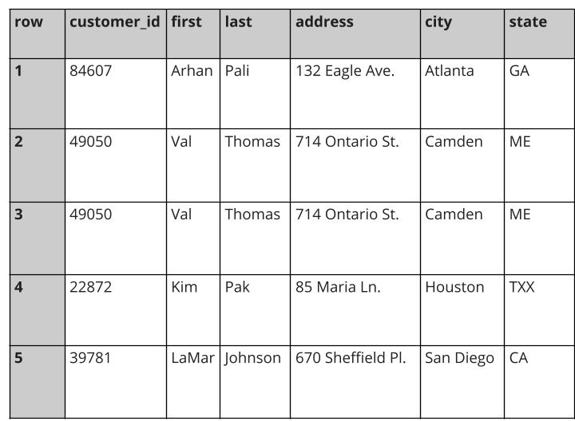

## Weekly challenge 3

Latest Submission Grade: 100%

&nbsp;

### Question 1

A data analyst is analyzing medical data for a health insurance company. The dataset contains billions of rows of data. Which of the following tools will handle the data most efficiently? 

* A word processor 
* **SQL**
* A presentation 
* A spreadsheet

> SQL will handle the data most efficiently. SQL can handle huge amounts of data. 

&nbsp;

### Question 2

What are some of the benefits of using SQL for analysis? Select all that apply.

* SQL tracks changes across a team.
* **SQL can pull information from different database sources.**
* SQL has built-in functionalities.
* **SQL interacts with database programs.**

> Some benefits of SQL include tracking changes across a team, interacting with database programs, and pulling information from different database sources.

&nbsp;

### Question 3

A data analyst creates many new tables in their company’s database. When the project is complete, the analyst wants to remove the tables so they don’t clutter the database. What SQL commands can they use to delete the tables? 

* UPDATE 
* CREATE TABLE IF NOT EXISTS 
* **DROP TABLE IF EXISTS**
* INSERT INTO 

> The analyst can use the DROP TABLE IF EXISTS query to delete the tables so they don’t clutter the database. 

&nbsp;

### Question 4:

A data analyst is cleaning customer data for an online retail company. They are working with the following section of a database:

The analyst wants to return a list of all unique customer IDs to identify the states in which they have customers. What is the correct SQL clause to retrieve the customer IDs?

* **DISTINCT customer_id**
* WHERE customer_id
* SUBSTR customer_id
* LENGTH customer_id

> The correct statement is DISTINCT customer_id.

&nbsp;

### Question 5

A data analyst is cleaning a dataset. They find data entries with extra spaces. What SQL function can the analyst use to eliminate the extra spaces for consistency? 

* SUBSTR
* CAST
* **TRIM**
* LENGTH

> The analyst can use the TRIM function to eliminate the extra spaces for consistency. 

&nbsp;

### Question 6

A data analyst is cleaning transportation data for a ride-share company. The analyst converts the data on ride duration from text strings to floats. What does this scenario describe? 

* Visualizing 
* **Typecasting**
* Processing 
* Calculating 

> The analyst is typecasting. Typecasting means converting data from one type to another. 

&nbsp;

### Question 7
Fill in the blank: In SQL databases, the _____ function can be used to convert data from one datatype to another. 

* SUBSTR
* TRIM
* **CAST**
* LENGTH

> The CAST function can be used to convert data from one datatype to another. 

&nbsp;

### Question 8

What SQL function lets you add strings together to create new text strings that can be used as unique keys? 

* COALESCE
* LENGTH
* CAST
* **CONCAT**

> The CONCAT function lets you add strings together to create new text strings that can be used as unique keys.
