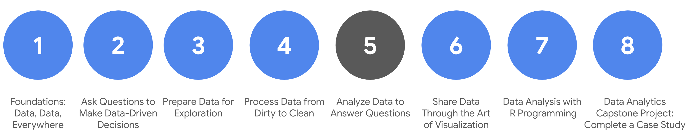

# Course syllabus

1. Foundations: Data, Data, Everywhere
2. Ask Questions to Make Data-Driven Decisions
3. Prepare Data for Exploration  
4. Process Data from Dirty to Clean 
5. **Analyze Data to Answer Questions** (this course)
6. Share Data Through the Art of Visualization 
7. Data Analysis with R Programming 
8. Google D​ata Analytics Capstone: Complete a Case Study 

Welcome to the fifth course in the series for the Google Data Analytics Certificate! The goal of data analysis is to make sense out of the data you collect and receive. Up until now, your focus has been on the preparations a data analyst goes through before entering the analysis phase. Specifically, in the last course, you learned about checking data for completeness and cleaning it for accuracy and reliability. 

If you feel like a hiker who has climbed a great distance to get to higher ground, we are excited to tell you that you have arrived! You have reached a stage where you are ready to work directly with data. You will organize and format data. This will help you think about data in different ways. Similar to how the view from a hiker’s lookout is amazing, your view of data from this point on will be spectacular.  

You will have hands-on practice organizing, sorting, filtering, formatting, converting, and combining data in spreadsheets. These are tasks you would complete in a real data analysis project. You will also learn how to sort and filter your data using SQL queries. You will be using functions and writing queries frequently as you continue your learning.  

&nbsp;
 
## Course content

C​ourse 5 – Analyze Data to Answer Questions

1. **O​rganizing data to begin analysis.** Organizing data makes the data easier to use in an analysis. In this part of the course, you will learn the importance of organizing your data with sorting and filtering. You will explore organizing data in both spreadsheets and with SQL queries and temporary tables.
2. **F​ormatting and adjusting your data.** As you move closer to analyzing your data, you will want to have the data formatted and ready to go. In this part of the course, you will learn all about converting and formatting data, including how to use SQL queries to combine data. You will also discover the value of feedback and support from your colleagues and how it can lead to new insights that you can apply to your work.
3. **A​ggregating data for analysis.** During an analysis, you might need to combine data to gain insights and complete business objectives. In this part of the course, you will explore the functions, procedures, and syntax to combine, or aggregate data. You will learn how to combine data within multiple cells in spreadsheets, and within multiple database tables using SQL queries. 
4. **Performing d​ata calculations.** Calculations are one of the more common tasks that data analysts perform during an analysis. In this part of the course, you will explore formulas, functions, and pivot tables in spreadsheets and SQL queries. All of these are used in data calculations. You will also learn about the benefits of using SQL to manage temporary database tables. 
5. **Completing the C​ourse Challenge.** At the end of this course, you will be able to put everything you have learned into perspective with the Course Challenge. The Course Challenge will ask you questions about the main concepts and then give you an opportunity to apply what you have learned in three scenarios.

&nbsp;

## What to expect

You can expect to finish this course in about five weeks when you have completed all of the prescribed activities, which include:

* **V​ideos** of instructors teaching new concepts and demonstrating the use of tools 
* **In-video questions** that pop up during or at the end of a video to check your learning
* **Readings** to introduce new ideas and build on the concepts from the videos
* **Discussion forums** to discuss, explore, and reinforce new ideas for better learning
* **D​iscussion prompts** to promote thinking and engagement in the discussion forums
* **Q​wiklabs** to introduce real-world, on-the-job situations, and the tools and tasks to complete assignments 
* **Practice quizzes** to prepare you for graded quizzes
* **Hands-on activities** to reinforce learned skills for the graded quizzes
* **Graded quizzes** to measure your progress and give you valuable feedback 

Hands-on activities promote additional opportunities to build your skills. Try to get as much out of them as possible. Assessments are based on the approach taken by the course to offer a wide variety of learning materials and activities that reinforce important skills. Graded and ungraded quizzes will help the content sink in. Ungraded practice quizzes are a chance for you to prepare for the graded quizzes. Both types of quizzes can be taken multiple times. 

As a quick reminder, this course is designed for all types of learners, with no degree or prior experience required. Everyone learns differently, so the Google Data Analytics Certificate has been designed with that in mind. Personalized deadlines are just a guide, so feel free to work at your own pace. There is no penalty for late assignments. If you prefer, you can extend your deadlines by returning to **Overview** in the navigation panel and clicking **Switch Sessions**. If you would like to review previous content or get a sneak peek of upcoming content, you can use the navigation links at the top of this page to go to another course in the program. When you pass all required assignments, you will be on track to earn your certificate. 

&nbsp;

## Tips

* Try to complete all items in order. All new information builds on previous lessons.
* Treat every task as if it is real-world experience. Have a mindset that you are working at a company or in an organization as a data analyst. This will help you apply what you learn to the real world.
* Repeat demonstrated tasks on your own for extra practice and speed.
* Even though they aren’t graded, it is important to complete all practice items. They will help you build a strong foundation as a data analyst and  prepare you for the graded assessments.
* Take advantage of all additional resources provided, including discussion forums and links to external articles for more information.
* W​hen you encounter useful links in the course, remember to bookmark them so you can refer to the information later for study or review.
* Additional resources are free, but some sites place limits on how many articles you can access for free each month. Sometimes you can register on the site for full access, but you can always bookmark a resource and come back to view it later.
* Use a notebook or electronic journal to keep track of new formulas, functions, and syntax that you learn. That way, you will be able to refer back to any notes as needed. 

Data analysts use spreadsheets and SQL queries a lot. If you perform all of the assigned activities in the application environments that are recommended, you will get a good idea of what you could be doing on the job as a data analyst.
