# Course challenge

Latest Submission Grade: 100%

&nbsp;

## Scenario 1, Questions 1-7

For the past six months, you have been working for a direct-mail marketing firm as a junior marketing analyst. Direct mail is advertising material sent to people through the mail. These people can be current or prospective customers, clients, or donors. Many charities depend on direct mail for financial support.

Your company, Directly Dynamic, creates direct-mail pieces with its in-house staff of graphic designers, expert mail list services, and on-site printing. Your team has just been hired by a local nonprofit, Food Justice Rock Springs. The mission of Food Justice Rock Springs is to eliminate food deserts by establishing local gardens, providing mobile pantries, educating residents, and more. Click below to read the email from Tayen Bell, vice president of marketing and outreach.

[C5 Course Challenge, Email From Tayen Bell, Directly Dynamic.pdf](activity/C5_Course_Challenge_Email_From_Tayen_Bell_Directly_Dynamic.pdf)

You begin by reviewing the dataset: [Dynamic Dataset](activity/Dynamic_Dataset.xlsx)

The client has asked you to send two separate mailings: one to people within 50 miles of Rock Springs; the other to anyone outside that area. So, to research each donor’s distance from the city, you first need to find out where all of these people live.

You could scroll through 209 rows of data, but you know there is a more efficient way to organize the cities. 

**Which of the following procedures will enable you to sort your spreadsheet by city (Column K) in ascending order? Select all that apply.**

* **Select A2-R210, then use the drop-down menu to Sort Sheet by Column K from A to Z**
* Use the SORT function syntax: =SORT(A2:R210, K, TRUE)
* **Use the SORT function syntax: =SORT(A2:R210, 11, TRUE)**
* Select A2-R210, then use the drop-down menu to Sort Range by Column K from A to Z

> To sort your spreadsheet by city in ascending order, you can use one of two methods. You can use the SORT function syntax =SORT(A2:R210, 11, TRUE). You can also select A2-R210, then use the drop-down menu to Sort Sheet by Column K from A to Z.

&nbsp;

### Question 2

You notice that many cells in the city column, Column K, are missing a value. So, you use the zip codes to research the correct cities. Now, you want to add the cities to each donor’s row. However, you are concerned about making a mistake, such as a spelling typo.

**Fill in the blank: To add drop-down lists to your worksheet with predetermined options for each city name, you decide to use _____.**

* the LIST function
* VLOOKUP
* **data validation**
* the find tool

> You decide to use data validation. Data validation allows you to control what can and cannot be entered in your worksheet in order to avoid typos. It does this by adding drop-down lists with predetermined options, such as each city name. 

&nbsp;

### Question 3

Now, you decide to address Tayen’s request to include a handwritten note in the direct-mail piece for anyone who gave at least $100 last year. 

**To change how cells appear, you use conditional formatting. Then, to highlight cells with a value of at least $100, you choose to format cells if they have a value greater than or equal to 100.**

* **True**
* False

> To change how cells appear, you would use conditional formatting. Then, choose to format cells if they are greater than or equal to 100.

&nbsp;

### Question 4

At this point, you notice that the information about state and zip code is in the same row. However, your company’s mailing list software requires states to be on a separate line from zip codes. 

**What function will enable you to move the 2-character state abbreviation in cell L2 into its own column?**

* **=LEFT(L2,2)**
* =LEFT(2,L2)
* =RIGHT(2,L2)
* =RIGHT(L2,2)

> To move the 2-character state abbreviations in Column L into their own column, use the LEFT function: =LEFT(L2,2).

&nbsp;

### Question 5

Next, you duplicate your dataset twice using the Sheet Menu. You rename the first sheet Donation Form List, and you remove the cities that are further than 50 miles from Rock Springs. You rename the second sheet Postcard List, and you remove the cities that are within 50 miles of Rock Springs.

Then, you import these datasets into your company’s mailing list database. In a mailing list database, you create two tables: Donation_Form_List and Postcard_List. You decide to clean the Donation_Form_List first. 

Your company’s mailing list software requires units to be on the same line as street addresses. However, they are currently in two separate columns (street_address and unit). 

**Which SQL function will instruct the database to combine two columns into a new column called “address”?**

* **CONCAT**
* CAST
* COMBINE
* COALESCE

> The CONCAT function is used to instruct a database to combine two columns into a new column called “address.”

&nbsp;

### Question 6

Your database contains people who live across Wyoming. However, it’s important to align your in-house data with the data from Food Justice Rock Springs. You also need to separate your data into the two lists: Donation_Form_List and Postcard_List. They will be based on each city’s distance from Rock Springs.

**The zip codes are in a column called zip_code. What query do you use to select all data from the Donation_Form_List organized by zip code?**

* `SELECT * FROM zip_code SORT BY Donation_Form_List`
    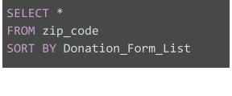

* **`SELECT * FROM Donation_From_List ORDER BY zip_code`**
  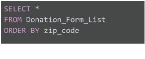

* `SELECT * FROM Donation_From_List ORDER BY zip_code`
  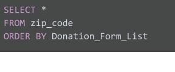
* `SELECT * FROM Donation_From_List ORDER BY zip_code` 
  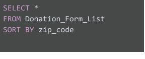

> To organize your data by zip code, the correct query is 
` SELECT * FROM Donation_From_List ORDER BY zip_code`

&nbsp;

### Question 7

You finish cleaning your datasets, so you decide to review Tayen’s email one more time to make sure you completed the task fully. It’s a good thing you checked because you forgot to identify people who have served on the board of directors or board of trustees. She wants to write them a thank-you note, so you need to locate them in the database.

**To retrieve only those records that include people who have served on the board of trustees or on the board of directors, you use the WHERE function. The syntax is:**

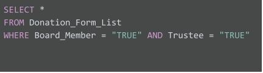

* True
* **False**

> To retrieve only those records that include people who have served on the board of trustees or on the board of directors, the syntax must include “OR.” Including “AND” will only retrieve records of people who served on both boards. The syntax is: 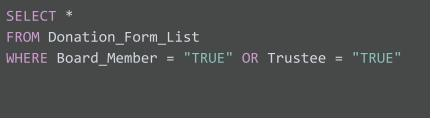

&nbsp;

## Scenario 2, Questions 8-13

### Question 8

Your company’s direct-mail campaign was very successful, and Food Justice Rock Springs has continued partnering with Directly Dynamic. One thing you’ve been working on is assigning all donors identification numbers. This will enable you to clean and organize the lists more effectively.

Meanwhile, another team member has been creating a prospect list that contains data about people who have indicated interest in getting involved with Food Justice Rock Springs. These people are also assigned a unique ID. Now, you need to compare your donor list with the dataset in your database and collect certain data from both.

**What SQL function will return records with matching values in both tables?**

* OUTER JOIN
* **INNER JOIN**
* RIGHT JOIN
* LEFT JOIN

> An INNER JOIN function will return records with matching values in both tables.

&nbsp;

### Question 9

Your next task is to identify the average contribution given by donors over the past two years. Tayen will use this information to set a donation minimum for inviting donors to an upcoming event.

**You have performed the calculations for 2019, so now you move on to 2020. To return average contributions in 2020 (contributions_2020), you use the AVG function. You use the following section of a SQL query to find this average and store it in the AvgLineTotal variable.**

* **True**
* False

> To return average contributions in 2020, the correct portion of the SQL query is:

&nbsp;

### Question 10

Now that you provided her with the average donation amount, Tayen decides to invite 50 people to the grand opening of a new community garden. You return to your New Donor List spreadsheet to determine how much each donor gave in the past two years. You will use that information to identify the 50 top donors and invite them to the event. 

**What syntax adds the contribution amounts in cells O2 and P2? Select all that apply.**

* **=O2+P2**
* =O2,P2
* **=SUM(O2,P2)**
* =(O2/P2)
  
> To add cells O2 and P2, use the function =SUM(O2,P2). You can also use the formula =O2+P2.

&nbsp;

### Question 11

Tayen informs you that she’s thinking about inviting anyone who donated at least $100 in 2018, as well. However, she only has five open spaces. She asks you to report how many people gave at least $100 so she can determine if they can also be invited to the event.

**The correct syntax to count how many donations of $100 or greater appear in Column Q is =SUMIF(Q2:Q210,">=100").**

* True
* **False**

> To count how many donations of $100 or greater appear in Column Q, the correct syntax is =COUNTIF(Q2:Q210,">=100").

&nbsp;

### Question 12

The community garden grand opening was a success. In addition to the 55 donors Food Justice Rock Springs invited, 20 other prospects attended the event. Now, Tayen wants to know the percentage of donations that came in that day from the new prospects compared to the original donors.

**Which SQL query can be used to calculate the percentage of contributions from prospects?**

* `SELECT event_contributions, Total_donors, Total_prospects, ("Total_prospects" / "Total_donors" * 100) AS Prospects_Percent FROM contributions_data`
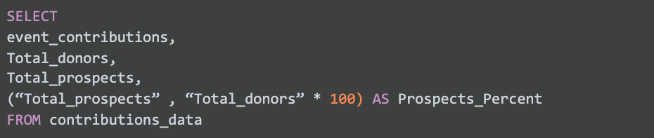
  
* `SELECT event_contributions, Total_donors, Total_prospects, (Total_prospects / Total_donors x 100) AS Prospects_Percent FROM contributions_data`
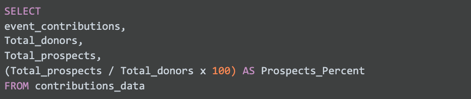

* `SELECT event_contributions, Total_donors, Total_prospects, (Total_prospects AND Total_donors = 100) AS Prospects_Percent FROM contributions_data`
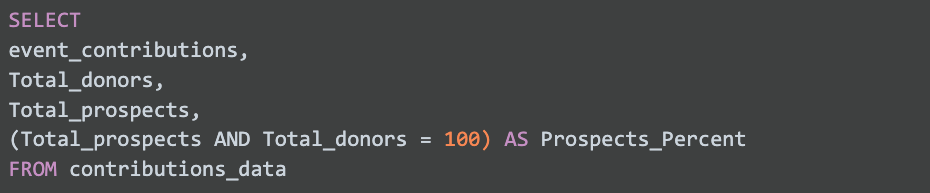 

* **`SELECT event_contributions, Total_donors, Total_prospects, (Total_prospects / Total_donors * 100) AS Prospects_Percent FROM contributions_data`**
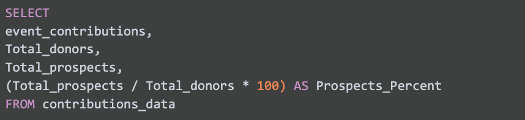
  

> To identify the percentage of contributions from prospects, the correct query is: 

&nbsp;

### Question 13

Your team creates a highly effective prospects list for Food Justice Rock Springs. After a few months, many of these prospects become donors. Now, Tayen wants to know the top three cities in which these new donors live. She will use that information to determine if it’s still true that people who live closer to Rock Springs are more likely to donate.

**What clause do you add to the following query to sort the donors in each city from high to low?**

* ORDER BY CITY(DonorID) ASC
* ORDER BY COUNT(DonorID) ASC
* ORDER BY CITY(DonorID) DESC
* **ORDER BY COUNT(DonorID) DESC**

> To retrieve the number of donors in each city, sorted high to low, the correct SQL query is: 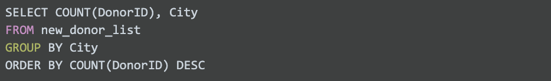
