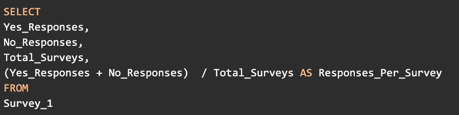
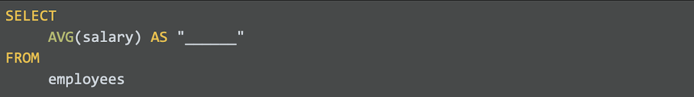
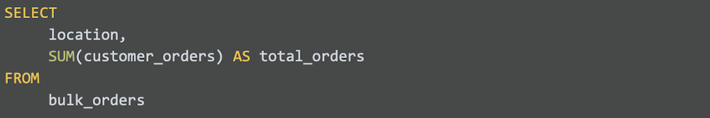

## Weekly challenge 4

Latest Submission Grade: 100%

&nbsp;

### Question 1
You are using a dataset in a spreadsheet from an advertising firm. Stakeholders have asked you to find the cost that an advertiser would pay for different types of ads. Which function should you use to find the highest cost for an ad?

* MIN 
* AVERAGE
* SUM 
* **MAX**

> You should use the MAX function to find the highest cost for an ad. The MAX function returns the largest numeric value from a range of cells.

&nbsp;

### Question 2

A data analyst is working with a spreadsheet from a furniture company.

[Sample Transaction Table](activity/Sample_Transaction_Table_Transactional_Data_Format.csv)

Sample Transaction Table - transactional-data-format-csv.csv
The analyst inputs a function to find the number of product prices that are less than $150.00. Which formula will return that result?

* **=COUNTIF(G2:G30, “<150”)**
* =COUNTIF(G2:G30, “>=150”)
* =SUMIF(G2:G30, “>150”)
* =SUMIF(G2:G30, “<150”)

> The COUNTIF formula =COUNTIF(G2:G30, “<150”) will allow the analyst to count all product price values in Column G that are less than $150. 

&nbsp;

### Question 3
A data analyst is working in a spreadsheet and uses the SUMIF function in the formula below as part of their analysis. 

`=SUMIF(A1:A25, ”<10”, C1:C25)`

Which part of this formula is the criteria or condition? 

* **"<10"**
* C1:C25
* A1:A25
* =SUMIF 

> The criteria or condition for this SUMIF formula is “<10”. This means that if any values in the range A1 through A25 are less than 10, their corresponding values in the range C1 through C25 will be added together.

&nbsp;

### Question 4
A data analyst is working with a spreadsheet from a retailer. 

[Retail Sales Data](activity/Retail_Sales_Data_Transactional_Data_Format.csv)

The analyst wants to figure out the value of all of the items in the spreadsheet. Which formula will calculate the total price of all of the items in Column C?

* =SUMIF(B2:B21, “=1”)
* =SUM(C2:C21)
* =SUMIFS(C2:C21,B2:B21,"1",A2:A21,"_20")
* **=SUMPRODUCT(B2:B21,C2:C21)**

> To calculate the value of all items in Column C, use the SUMPRODUCT function and the range C2:C21.

&nbsp;

### Question 5
A data analyst creates a pivot table in a spreadsheet containing movie data. 

[Movie Data Project](activity/Movie_Data_Starter_Project.xlsx)

If the analyst wants to summarize the data using the AVERAGE function in the Values menu, which spreadsheet columns could they add data from? Select all that apply.

* **Box Office Revenue** 
* Movie Title
* Genre
* **Budget**

> To summarize the data using the AVERAGE function, the analyst could use the Budget column or the Box Office Revenue column. Both have numeric values that the AVERAGE function could calculate.

&nbsp;

### Question 6
Which part of the following SQL query enables an analyst to control the order of the calculations?

* FROM Survey_1
* **(Yes_Responses + No_Responses)**
* Yes_responses 
* AS Responses_Per_Survey

> In a SQL query with calculations, an analyst includes parentheses to control the order of the calculations. The parentheses tell the server which calculation to complete first. 

&nbsp;

### Question 7
Fill in the blank: In a SQL query, the _____ operator returns the remainder when one number is divided by another.

* **modulo**
* subtraction 
* division
* comparison 

> In a SQL query, the modulo operator (%) returns the remainder when one number is divided by another. 

&nbsp;

### Question 8
A data analyst uses the following SQL query to complete a calculation. How should the analyst name the value that this calculation will return?

* total_employee_salary
* employee_id
* **average_employee_salary**
* number_of_employees

> The analyst should name this column “average_employee_salary” to name the value that this calculation will return. The AVG function is an aggregate function that returns the average value of a group. In this query, the group is “salary.”

&nbsp;

### Question 9
Use the following SQL query to answer the question: 

Which statement should you add after the FROM statement to organize rows by location?

* `WHERE location`
* **`GROUP BY location`**
* `EXTRACT location`
* `AS location`

> You should add the GROUP BY statement to organize rows by location. In this query, GROUP BY groups rows from the Bulk_orders table with the same location value into summary rows.

&nbsp;

### Question 10
A data analyst is analyzing financial data in a spreadsheet. They pause their analysis to begin the data validation process. What should they do during this process? Select all that apply.

* **Review dates for consistency**
* **Check for errors in their formulas**
* Share their spreadsheet with stakeholders
* Visualize their findings

> The analyst should check for errors in their formulas. The data validation process involves checking and rechecking the quality of the data to make sure that it is complete, accurate, secure, and consistent.
