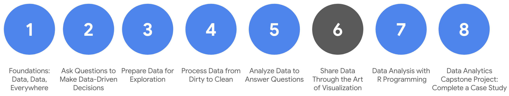

# Course syllabus

1. Foundations: Data, Data, Everywhere
2. Ask Questions to Make Data-Driven Decisions
3. Prepare Data for Exploration  
4. Process Data from Dirty to Clean 
5. Analyze Data to Answer Questions 
6. **Share Data Through the Art of Visualization**(this course)
7. Data Analysis with R Programming 
8. Google D​ata Analytics Capstone: Complete a Case Study 

Welcome to the sixth course in the Google Data Analytics Certificate! In the previous course, you learned how to organize and prepare data for analysis by sorting, formatting, converting, and merging it. You also worked with spreadsheet functions and calculations. And, you wrapped it up by learning how to sort data and perform calculations using SQL queries and temporary tables. In summary, you learned to use basic tools of the trade. A cook who has basic knife skills is prepared to work in the kitchen. A data analyst who can “slice and dice” data using spreadsheets and SQL queries is prepared to work in business.

In this course, you will learn how to create data visualizations. Everyone enjoys a good story. Visualizations along with good data storytelling will help you communicate the meaning of a dataset to your audience. Sharing the results of an analysis is actually one of the most important parts of an analyst’s job. Do you want the results of your analysis to just show up, or do you want the results to show off?

You too can become a talented data storyteller! You will learn basic principles and best practices for data visualization in spreadsheets. You will also gain hands-on experience with data visualizations in Tableau, a specialized data visualization tool. You will also learn how to apply pro tips to create exciting visualizations, presentations, and talking points about your data. And finally, you will learn to prepare and deliver great presentations. You will be ready to get through tough questions about your data analysis with confidence.  

&nbsp;
 
## Course content

Course 6 – Share Data Through the Art of Visualization

1. **Data visualization:** Data visualization is in many ways the culmination of the data analysis process. In this part of the course, you will be introduced to the concepts involved in data visualization. You will learn about accessibility, design thinking, and other factors that play a role in visualizing the data in your analysis.
2. **Data visualizations with Tableau:** Tableau is a tool that can help analysts create effective data visualizations. In this part of the course, you will learn all about Tableau and its uses. You will also explore the importance of creativity and clarity while visualizing your findings appropriately.
3. **Stories about your data:** Connecting your objective with your data through insights is essential to good data storytelling. In this part of the course, you will learn about data-driven stories and their attributes. You will also gain an understanding of how to use Tableau to create dashboards and dashboard filters. 
4. **Developing presentations and slideshows:** In this part of the course, you will discover how to give an effective presentation about your data analysis. You will consider all aspects of your analysis when creating a presentation and learn how to use multiple data sources in the data visualizations you will share. In addition, you will learn how to anticipate potential limitations and questions that might arise and how to provide useful answers to stakeholders.
5. **Course Challenge:** At the end of this course, you will be able to put everything you have learned into practice with the Course Challenge. The Course Challenge will ask you questions about key principles you have been learning about and then give you an opportunity to apply those principles in two scenarios. 

&nbsp;

## What to expect

You can expect to finish this course in about five to six weeks. Be prepared to spend a lot more of your time practicing and working with the tools introduced. Not only will you understand the features of the tools, you will use them for specific tasks–just as you would if you were on the job as a data analyst.

You will be on track to earn the certificate after completing all of the prescribed activities, which include:

* **V​ideos** of instructors teaching new concepts and demonstrating the use of tools 
* **In-video questions** that pop up during or at the end of a video to check your learning
* **Readings** to introduce new ideas and build on the concepts from the videos
* **Discussion forums** to discuss, explore, and reinforce new ideas for better learning
* **D​iscussion prompts** to promote thinking and engagement in the discussion forums
* **Q​wiklabs** to introduce real-world, on-the-job situations, and the tools and tasks to complete assignments 
* **Practice quizzes** to prepare you for graded quizzes
* **Hands-on activities** to reinforce learned skills for the graded quizzes
* **Graded quizzes** to measure your progress and give you valuable feedback 

Hands-on activities promote additional opportunities to build your skills. Try to get as much out of them as possible. Assessments are based on the approach taken by the course to offer a wide variety of learning materials and activities that reinforce important skills. Graded and ungraded quizzes will  help the content sink in. Ungraded practice quizzes are a chance for you to prepare for the graded quizzes, and both types of quizzes can be taken more than one time. 

As a quick reminder, this course is designed for all types of learners, with no degree or prior experience required. Everyone learns differently, so the Google Data Analytics Certificate has been designed with that in mind. Personalized deadlines are just a guide, so feel free to work at your own pace. There is no penalty for late assignments. If you prefer, you can extend your deadlines by returning to **Overview** in the navigation pane and clicking **Switch Sessions**. If you already missed previous deadlines, click **Reset my deadlines** instead.

If you would like to review previous content or get a sneak peek of upcoming content, you can use the navigation links at the top of this page to go to another course in the program. When you pass all the required assignments, you will be on track to earn your certificate. 

&nbsp;

## Tips

* Try to complete all items in order. All new information builds on previous lessons.
* Treat every task as if it is real-world experience. Have a mindset that you are working at a company or in an organization as a data analyst. This will help you apply what you learn in this program to the real world.
* Repeat demonstrated tasks on your own for extra practice and speed.
* Even though they aren’t graded, it is important to complete all practice items. They will help you build a strong foundation as a data analyst and prepare you for the graded assessments.
* Take advantage of all of the additional resources provided, including discussion forums and links to external articles for more information.
* W​hen you encounter useful links in the course, remember to bookmark them so you can refer to the information later for study or review.
* Additional resources are free, but some sites place limits on how many articles you can access for free each month. Sometimes you can register on the site for full access, but you can always bookmark a resource and come back to view it later.
* Create a notebook or electronic journal to keep track of things to remember about using Tableau. This will become a handy and personalized reference that you can use when you need it.
