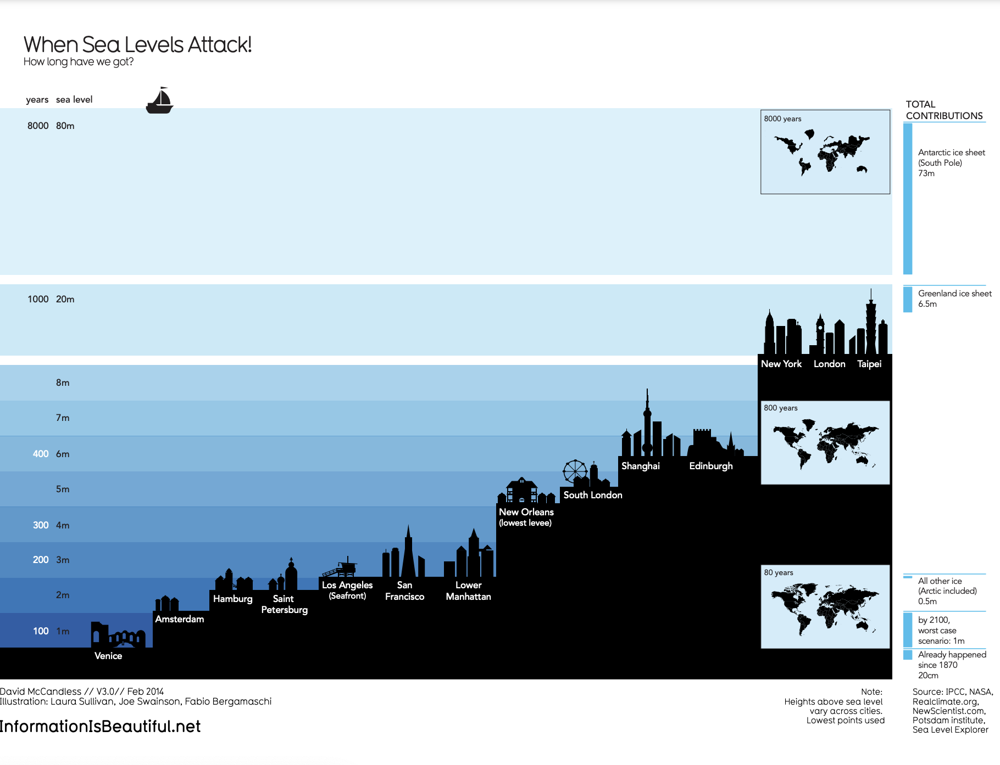

# Data is beautiful

&nbsp;

At this point, you might be asking yourself: What makes a good visualization? Is it the data you use? Or maybe it is the story that it tells? In this reading, you are going to learn more about what makes data visualizations successful by exploring David McCandless’s elements of successful data visualization and evaluating three examples based on those elements. Data visualization can change our perspective and allow us to notice data in new, beautiful ways. A picture is worth a thousand words—that’s true in data too! You'll have the option to save all of the data visualization examples that are used throughout this reading; these are great examples of successful data visualization that you can use for future inspiration.

You can also access a PDF version of this visualization and save it for your own reference by clicking the file below: 

[WEB_What-Makes-a-Good-Infoviz](files/Web_What_Makes_A_Good_Infoviz.pdf)

As a review, the above Venn diagram from David McCandless contains the four elements of successful visualization: 

* **Information (data):** The information or data that you are trying to convey is a key building block for your data visualization. Without information or data, you cannot communicate your findings successfully.
* **Story (concept):** Story allows you to share your data in meaningful and interesting ways. Without a story, your visualization is informative, but not really inspiring. 
* **Goal (function):** The goal of your data visualization makes the data useful and usable. This is what you are trying to achieve with your visualization. Without a goal, your visualization might still be informative, but can’t generate actionable insights.
* **Visual form (metaphor):** The visual form element is what gives your data visualization structure and makes it beautiful. Without visual form, your data is not visualized yet. 

All four of these elements are important on their own, but a successful data visualization balances all four. For example, if your data visualization only has two elements, like the information and story, then you end up with a rough outline. This can be really useful in your early planning stages, but is not polished or informative enough to share. Even three elements are not quite enough— you need to consider all four to create a successful data visualization. Let’s use these elements to examine two successful data visualization examples and discuss why they are successful. 

&nbsp;

## Visualization of lifespan data 

&nbsp;

Save this data visualization as a PDF by clicking the file below:

[IIB-LiveLong.pdf](files/IIB-LiveLong.pdf)

This data visualization from David McCandless shows what choices can add or subtract years to our lifespans. This data visualization uses all four elements that we outlined earlier. Let’s examine those and discuss how they are all working together: 

* **Information (data):** This visualization uses data from multiple sources, which have been compiled for public access in [this spreadsheet](https://docs.google.com/spreadsheets/d/1OdddTttI2l47SIgH0VW-q4XfHNJRa6bMbNHL8N4edU8/copy). You may make a copy of the data or download the data from the file below. The data is clearly organized and outlined in the visualization, so it is obvious that this visualization has the information element. 
* **Story (concept):** The concept behind this data visualization is clearly stated in the title: finding out what really extends a lifespan. But, the visualization also uses the data gathered and presented earlier to put together the ultimate recipe for a long life, which is a nice ending to the overarching story being told in this visualization. 
* **Goal (function):** The goal of this data visualization is also pretty clear from the title: It is trying to find out what can extend someone’s lifespan, which might help people make better choices about their own lives. 
* **Visual form (metaphor):** This data visualization uses a lot of visual components to help structure the information. First, it has been organized in a vertical bar chart and has both years lost and years gained from particular choices. This makes it easier to read each choice and the commentary. It also draws the eye downward so that you have to read all of the elements before you get to the ultimate recipe at the end. This data visualization also uses color to communicate how strong the science behind each finding was, which makes this data visualization beautiful and informative. 

&nbsp;

## Visualization of dog breed comparison

&nbsp;

Save this data visualization as a PDF by clicking the file below:

[IIB-LICENSED_Best-in-Show.pdf](files/IIB-LICENSED_Best_in_Show.pdf)

This McCandless data visualization compares the popularity of different dog breeds to a more objective data score. Let’s check out how it uses the different elements of successful data visualization:

* **Information (data):** This visualization uses data from the American Kennel Club about different dog breeds. You [may make a copy of the data](https://docs.google.com/spreadsheets/d/1l_HfF5EaN-QgnLc2UYdCc7L2CVrk0p3VdGB1godOyhk/copy) or download from the file below. Like the lifespan example, you can actually check out this data for yourself and explore the metrics being recorded in this visualization. 
* **Story (concept):** This visualization shows us which dogs are overrated, rightly ignored, and some really hot dogs. And, the visualization reveals some overlooked treasures we might never have known about previously! 
* **Goal (function):** This visualization is interested in exploring the relationship between popularity and objective data scores for different dog breeds. By comparing these data points, we can learn more about how different dog breeds are perceived. 
* **Visual form (metaphor):** In addition to the actual four-square structure of this visualization, it uses visual form to communicate additional information about this dataset. The most obvious metaphor is that the data points in this graphic have been visualized as dogs. This visualization uses a few visual cues, like the size of the dog symbol or which direction the dog is facing, to communicate other information about the dog data.  

&nbsp;

## Visualization of rising sea levels

&nbsp;

Save this data visualization as a PDF by clicking the file below:

[IIB-LICENSED_Sea-Levels](files/IIB-LICENSED_Sea-Levels.pdf)

This McCandless data visualization demonstrates how much sea levels are projected to rise over the course of 8,000 years. The silhouettes of different cities with different sea levels, rising from right to left, helps to drive home how much of the world will be affected as sea levels continue to rise. Let’s explore how this data visualizations is using the four elements of successful visualization:

* **Information (data):** This visualization uses climate data on rising sea levels from a variety of sources, including NASA and the Intergovernmental Panel on Climate Change. In addition to that data, it also uses recorded sea levels from around the world to help illustrate how much rising sea levels will affect the world. 
* **Story (concept):** The visualization tells a very clear story: Over the course of 8,000 years, much of the world as we know it will be underwater. 
* **Goal (function):** The goal of this project is to demonstrate how soon rising sea levels are going to affect us on a global scale. Using both data and the visual form, this visualization makes rising sea levels feel more real to the audience. 
* **Visual form (metaphor):** The city silhouettes in this visualization are a beautiful way to drive home the point of the visualization. It gives the audience a metaphor for how rising sea levels will affect the world around them in a way that showing just the raw numbers can’t do. And for a more global perspective, the visualization also uses inset maps. 

Notice how all of these visualizations balance all four elements of successful visualization: They clearly incorporate data, use storytelling to make that data meaningful, focus on a specific goal, and structure the data with visual forms to make it beautiful and communicative. The more you practice thinking about these elements, the more you will be able to use them in your own data visualization.
