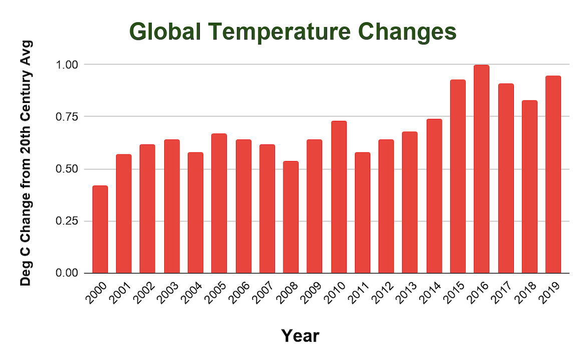
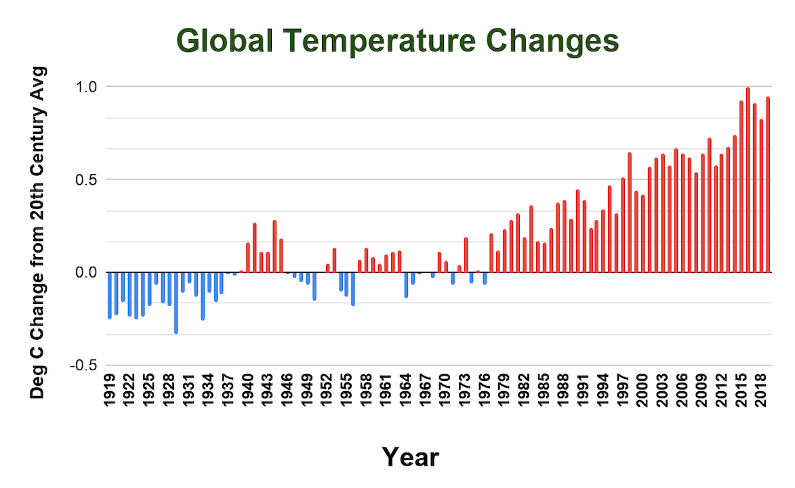
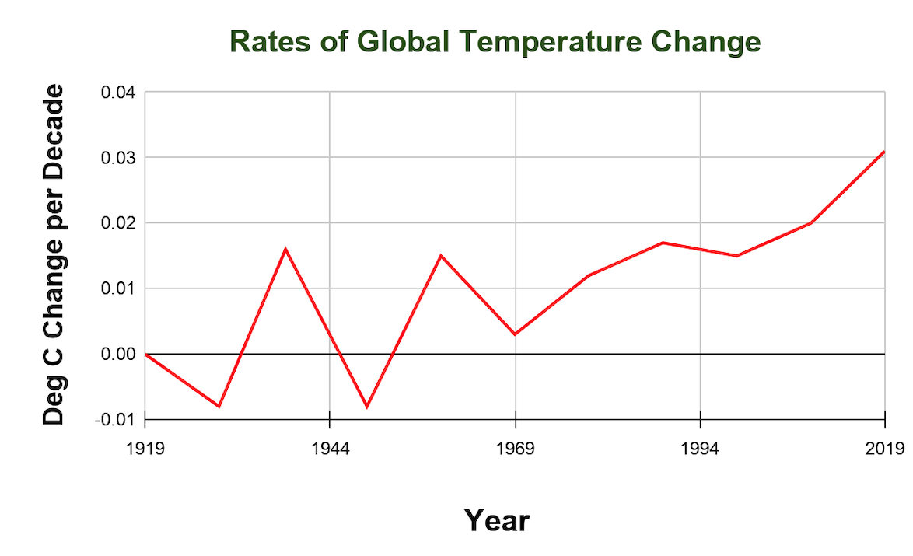
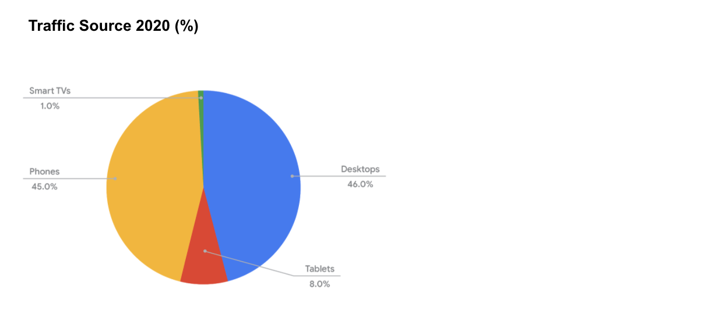
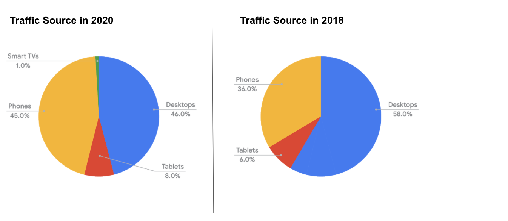
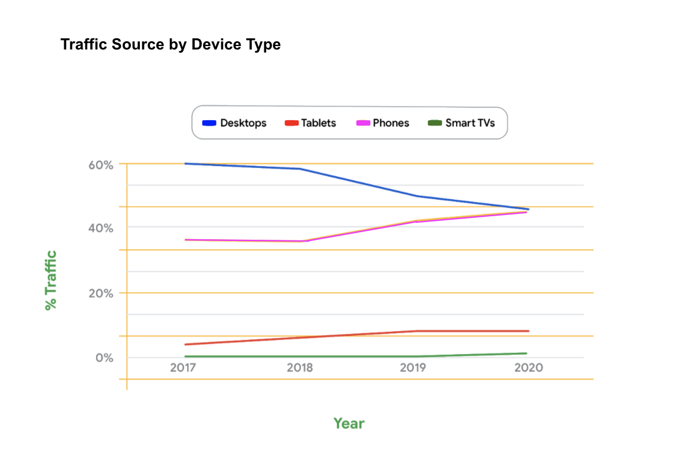

# Data visualization can make the difference

&nbsp;

Data might be a single source of truth, but it also causes lots of different reactions depending on how you present it. Data visualization can make the difference between good, better, and best when it comes to your data storytelling. You want to select the visualization that best explains what the data analysis reveals and why people should care.

In this reading, you will learn how selecting appropriate chart types and the right amount of data helps people come to the same conclusions as you. We will use side-by-side examples of data visualizations that are good, better, and best at communicating conclusions. In fact, a test for a good data visualization is whether people can draw the same conclusion you have about the data in five seconds or less!

&nbsp;

## Climate change: Visualizing the right amount of data

Imagine that you are a data analyst who is part of a team that concluded from the data that the rise in global temperatures must be slowed. 

* Familiarize yourself with the warming trend in [History of global surface temperature since 1880](https://www.climate.gov/news-features/understanding-climate/climate-change-global-temperature), an interactive graph. 
* View the [raw data](https://www.ncdc.noaa.gov/cag/global/time-series/globe/land_ocean/ytd/12/1880-2019) from the National Oceanic and Atmospheric Administration (NOAA). They measured temperature differences each year compared to the average temperature over a span of 100 years (the entire 20th century). 

Reference: NOAA National Centers for Environmental information, Climate at a Glance: Global Time Series, from [ncdc.noaa.gov/cag/](https://www.ncdc.noaa.gov/cag/)

&nbsp;

#### Good presentation

A good presentation might be a column chart with yearly temperature differences from the 20th century average temperature between the years 2000 to 2019 (the most recent 20 years of data available).

**Limitation**: This chart illustrates a 20-year trend of temperature changes going up from the 20th century average temperature. But it doesn’t do a great job illustrating that the temperature changes went up by a lot more in the last 20 years than in the past. So, more historical data needs to be plotted to show that trend.

&nbsp;

#### Better presentation

A better presentation might include a longer timeline to show that temperatures changes went up more steeply in the last 20 years.

**Limitation:** This chart does a much better job illustrating that temperatures went up more steeply in the last 20 years, but it doesn’t quantify the rate at which temperature changes sped up over time. 

&nbsp;

#### Best presentation

The best presentation might actually not display temperatures at all. A line chart with the rates of temperature change per decade might be more effective. It would draw people to the fact that the rates are going up. The chart below compares the rates of change at the end of each decade, from 1919 to 2019. Rates have increased nearly every decade since 1969, supporting the conclusion that the rise in global temperatures must be slowed. 

A note about rate calculation: The temperature change relative to the 20th century average at the beginning of a decade was subtracted from the temperature change relative to the 20th century average at the end of the decade. Each temperature difference was then divided by the period of 10 years to calculate the rate of change. 

**Limitation:** This chart is the best of the three visualizations to lead audiences to the conclusion that global temperature rise must be slowed. But other factors might also be driving climate change, like carbon emissions and population growth. Temperature change is one of multiple symptoms. Preparing additional data visualizations for carbon emissions and population growth would make the case to combat climate change even stronger.

&nbsp;

## Mobile devices: Visualizing growth

Imagine that you are a data analyst on a strategic planning team at a growing company. The team needs to provide direction by recommending how much of the company’s resources should go into desktop versus mobile website development. Based on their analysis of website traffic, the team is recommending to focus more resources on mobile website development.

&nbsp;

#### Good presentation

A good presentation might be a pie chart showing the share of traffic by device type, but it is only a snapshot of a given time.

**Limitation:** Although this pie chart shows the distribution of traffic by device type, it doesn’t show how one category grew or shrank over time.

&nbsp;

#### Better presentation

A better presentation might include multiple pie charts side-by-side to show the change in traffic over time. Notice that Smart TVs had 0% of the traffic in 2018.

**Limitation:** These pie charts show how the traffic changed between 2018 and 2020, but comparing more than two years of data with pie charts isn’t effective. 

&nbsp;

#### Best presentation

The best presentation might be a stacked line chart showing the percentage of each device type’s traffic over time.

&nbsp;

## Dashboards: Visualizing trends 

When monitoring trends, sometimes the data changes too quickly or comes from too many sources to be captured accurately in charts and graphs. In this case, a dashboard is the best way to visualize data from many sources. 

Here are some examples of dashboards used to visualize trends (and their likely goals):

* Cash flow and budgeting dashboard for a small business (to help the business stay on track with its budget and expenses)
* Company-wide dashboard (to help departments with metrics and benchmark against other departments)

One school district in Oakland, California makes their dashboards available for public use. These dashboards are interactive so you can customize your view of the data using drop-down sorting options. Use Oakland Unified School District's [public dashboard list](http://www.ousddata.org/public-dashboards.html) to view the dashboards and explore the data. 

&nbsp;

## Key takeaway

Study a data visualization you have created for five seconds—the five-second test. What draws your attention? Then ask yourself “is it good, or can it be better?” Doing this will help you figure out the best visualization for your audience. 
