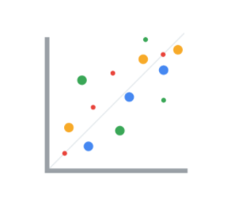

# Effective data visualizations

&nbsp;

A data visualization, sometimes referred to as a “data viz,” allows analysts to properly interpret data. A good way to think of data visualization is that it can be the difference between utter confusion and really grasping an issue. Creating effective data visualizations is a complex task; there is a lot of advice out there, and it can be difficult to grasp it all. In this reading, you are going to learn some tips and tricks for creating effective data visualizations. First, you'll review two frameworks that are useful for thinking about how you can organize the information in your visualization. Second, you'll explore pre-attentive attributes and how they can be used to affect the way people think about your visualizations. From there, you'll do a quick review of the design principles that you should keep in mind when creating your visualization. You will end the reading by reviewing some practices that you can use to avoid creating misleading or inaccurate visualizations. 

&nbsp;

## Frameworks for organizing your thoughts about visualization

Frameworks can help you organize your thoughts about data visualization and give you a useful checklist to reference. Here are two frameworks that may be useful for you as you create your own data viz: 

1) [The McCandless Method](https://www.informationisbeautiful.net/visualizations/what-makes-a-good-data-visualization/)

You learned about the David McCandless method in the first lesson on effective data visualizations, but as a refresher, the McCandless Method lists four elements of good data visualization: 

1. **Information:** the data you are working with
2. **Story:** a clear and compelling narrative or concept
3. **Goal:** a specific objective or function for the visual
4. **Visual form:** an effective use of metaphor or visual expression

Note: One useful way of approaching this framework is to notice the parts of the graphic where there is incomplete overlap between all four elements. For example, visual form without a goal, story, or data could be a sketch or even art. Data plus visual form without a goal or function is eye candy. Data with a goal but no story or visual form is boring. All four elements need to be at work to create an effective visual.

2) [Kaiser Fung’s Junk Charts Trifecta Checkup](https://junkcharts.typepad.com/junk_charts/junk-charts-trifecta-checkup-the-definitive-guide.html)

This approach is a useful set of questions that can help consumers of data visualization critique what they are consuming and determine how effective it is. The Checkup has three questions:

1. What is the practical question? 
2. What does the data say?
3. What does the visual say? 

Note: This checklist helps you think about your data viz from the perspective of your audience and decide if your visual is communicating your data effectively to them or not. In addition to these frameworks, there are some other building blocks that can help you construct your data visualizations. 

&nbsp;

## Pre-attentive attributes: marks and channels

Creating effective visuals means leveraging what we know about how the brain works, and then using specific visual elements to communicate the information effectively. **Pre-attentive attributes** are the elements of a data visualization that people recognize automatically without conscious effort. The essential, basic building blocks that make visuals immediately understandable are called marks and channels. 

#### Marks

**M​arks** are basic visual objects like points, lines, and shapes. Every mark can be broken down into four qualities: 

1. **Position** - Where a specific mark is in space in relation to a scale or to other marks

2. **Size** - How big, small, long, or tall a mark is

3. **Shape** - Whether a specific object is given a shape that communicates something about it

4. **Color** - What color the mark is

#### Channels

**C​hannels** are visual aspects or variables that represent characteristics of the data. Channels are basically marks that have been used to visualize data. Channels will vary in terms of how effective they are at communicating data based on three elements: 

1. **Accuracy** - Are the channels helpful in accurately estimating the values being represented? 

    For example, color is very accurate when communicating categorical differences, like apples and oranges. But it is much less effective when distinguishing quantitative data like 5 from 5.5.

2. **Popout** - How easy is it to distinguish certain values from others? 

    There are many ways of drawing attention to specific parts of a visual, and many of them leverage pre-attentive attributes like line length, size, line width, shape, enclosure, hue, and intensity.

3. **Grouping**- How good is a channel at communicating groups that exist in the data? 

    Consider the proximity, similarity, enclosure, connectedness, and continuity of the channel.

But, remember: the more you emphasize different things, the less that emphasis counts. The more you emphasize one single thing, the more that counts. 

&nbsp;

## Design principles

Once you understand the pre-attentive attributes of data visualization, you can go on to design principles for creating effective visuals. These design principles are important to your work as a data analyst because they help you make sure that you are creating visualizations that communicate your data effectively to your audience. By keeping these rules in mind, you can plan and evaluate your data visualizations to decide if they are working for you and your goals. And, if they aren’t, you can adjust them! 

| Principle                   | Description                                                                                                                                                                                                                                                                                                                              |
| --------------------------- | ---------------------------------------------------------------------------------------------------------------------------------------------------------------------------------------------------------------------------------------------------------------------------------------------------------------------------------------- |
| Choose the right visual     | One of the first things you have to decide is which visual will be the most effective for your audience. Sometimes, a simple table is the best visualization. Other times, you need a more complex visualization to illustrate your point.                                                                                               |
| Optimize the data-ink ratio | The data-ink entails focusing on the part of the visual that is essential to understanding the point of the chart. Try to minimize non-data ink like boxes around legends or shadows to optimize the data-ink ratio.                                                                                                                     |
| Use orientation effectively | Make sure the written components of the visual, like the labels on a bar chart, are easy to read. You can change the orientation of your visual to make it easier to read and understand.                                                                                                                                                |
| Color                       | There are a lot of important considerations when thinking about using color in your visuals. These include using color consciously and meaningfully, staying consistent throughout your visuals, being considerate of what colors mean to different people, and using inclusive color scales that make sense for everyone viewing them.  |
| Numbers of things           | Think about how many elements you include in any visual. If your visualization uses lines, try to plot five or fewer. If that isn’t possible, use color or hue to emphasize important lines. Also, when using visuals like pie charts, try to keep the number of segments to less than seven since too many elements can be distracting. |

&nbsp;

## Avoiding misleading or deceptive charts 

As you are considering what kind of visualization to create and how to design it, you will want to be sure that you are not creating misleading or deceptive charts. As you have been learning, data analysis provides people with insights and knowledge they can use to make decisions. So, it is important that the visualizations you create are communicating your data accurately and truthfully. Here are some common errors to avoid so that your visualizations aren’t accidentally misleading: 

| What to avoid                                                           | Why                                                                                                                                                                                                                                       |
| ----------------------------------------------------------------------- | ----------------------------------------------------------------------------------------------------------------------------------------------------------------------------------------------------------------------------------------- |
| Cutting off the y-axis                                                  | Changing the scale on the y-axis can make the differences between different groups in your data seem more dramatic, even if the difference is actually quite small.                                                                       |
| Misleading use of a dual y-axis                                         | Using a dual y-axis without clearly labeling it in your data visualization can create extremely misleading charts.                                                                                                                        |
| Artificially limiting the scope of the data                             | If you only consider the part of the data that confirms your analysis, your visualizations will be misleading because they don’t take all of the data into account.                                                                       |
| Problematic choices in how data is binned or grouped                    | It is important to make sure that the way you are grouping data isn’t misleading or misrepresenting your data and disguising important trends and insights.                                                                               |
| Using part-to-whole visuals when the totals do not sum up appropriately | If you are using a part-to-whole visual like a pie chart to explain your data, the individual parts should add up to equal 100%. If they don’t, your data visualization will be misleading.                                               |
| Hiding trends in cumulative charts                                      | Creating a cumulative chart can disguise more insightful trends by making the scale of the visualization too large to track any changes over time.                                                                                        |
| Artificially smoothing trends                                           | Adding smooth trend lines between points in a scatter plot can make it easier to read that plot, but replacing the points with just the line can actually make it appear that the point is more connected over time than it actually was. |

Finally, keep in mind that data visualization is an art form, and it takes time to develop these skills. Over your career as a data analyst, you will not only learn how to design good data visualizations, but you will also learn how to evaluate good data visualizations. Use these tips to think critically about data visualization—both as a creator and as an audience member.

&nbsp;

## Further reading

* [**The Wall Street Journal Guide to Information Graphics:** The Dos and Don'ts of Presenting Data, Facts, and Figures: ](https://www.amazon.com/Street-Journal-Guide-Information-Graphics/dp/0393072959)This is a comprehensive guide to data visualization, including chapters on basic data visualization principles and how to create useful data visualizations even when you find yourself in a tricky situation. This is a useful book to add to your data visualization library, and you can reference it over and over again. 
