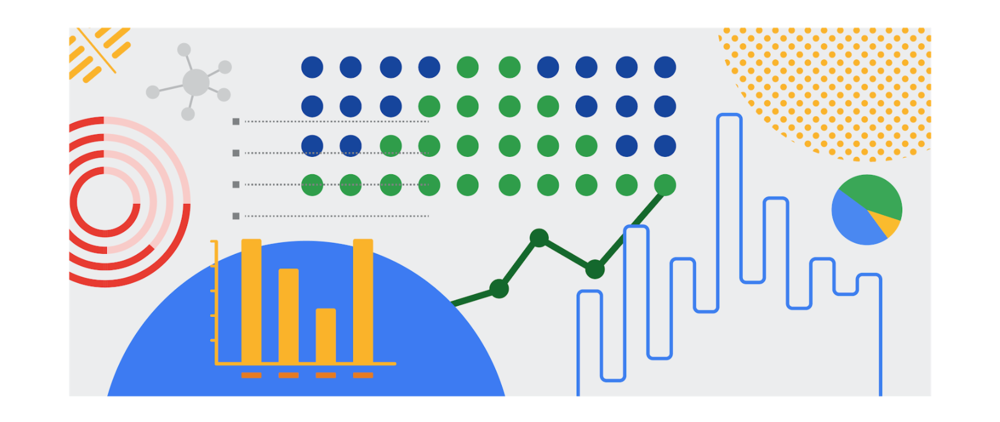

# The beauty of visualizing

&nbsp;

You will find that organizing your data and communicating your results are significant parts of a data analyst’s role. In this reading, you are going to navigate different resources for effective data visualization that will allow you to choose the best model to present your data. 

&nbsp;

## Inspiration is in the air

**Data visualization** is the graphical representation of data. But why should data analysts care about data visualization? Well your audience won’t always have the ability to interpret or understand the complex information that you relay to them so your job is to inform them of your analysis in a way that is meaningful, engaging, and easy to understand. Part of why data visualization is so effective is because people’s eyes are drawn to colors, shapes, and patterns, which makes those visual elements perfect for telling a story that goes beyond just the numbers. 

Of course, one of the best ways to understand the importance of data visualization is to go through different examples of it. As a junior data analyst, you want to have several visualization options for your creative process whenever you need. Below is a list of resources that can inspire your next data-driven decisions, as well as teach you how to make your data more accessible to your audience:

* [The data visualization catalogue:](https://datavizcatalogue.com/#google_vignette) Not sure where to start with data visualization? This catalogue features a range of different diagrams, charts, and graphs to help you find the best fit for your project. As you navigate each category, you will get a detailed description of each visualization as well as its function and a list of similar visuals. 
* [The 25 best data visualizations:](https://visme.co/blog/best-data-visualizations/) In this collection of images, explore the best examples of data that gets made into a stunning visual. Simply click on the link below each image to get an in-depth view of each project, and learn why making data visually appealing is so important.
* [10 data visualization blogs:](https://www.tableau.com/learn/articles/best-data-visualization-blogs) Each link will lead you to a blog that is a fountain of information on everything from data storytelling to graphic data. Get your next great idea or just browse through some visual inspiration.  
* [Information is beautiful:](https://informationisbeautiful.net/wdvp/gallery-2019/) Founded by David McCandless, this gallery is dedicated to helping you make clearer, more informed visual decisions based on facts and data. These projects are made by students, designers, and even data analysts to help you gain insight into how they have taken their own data and turned it into visual storytelling.
* [Data studio gallery:](https://datastudio.google.com/gallery?category=visualization) Information is vital, but information presented in a digestible way is even more useful. Browse through this interactive gallery and find examples of different types of data communicated visually. You can even use the data studio tool to create your own data-driven visual.

&nbsp;

## Engage your audience

Remember: an important component of being a data analyst is the ability to communicate your findings in a way that will appeal to your audience. Data visualization has the ability to make complex (and even monotonous) information easily understood, and knowing how to utilize data visualization is a valuable skill to have. Your goal is always to help the audience have a conversation with the data so your visuals draw them into the conversation. This is especially true when you have to help your audience engage with a large amount of data, such as the flow of goods from one country to other parts of the world.
