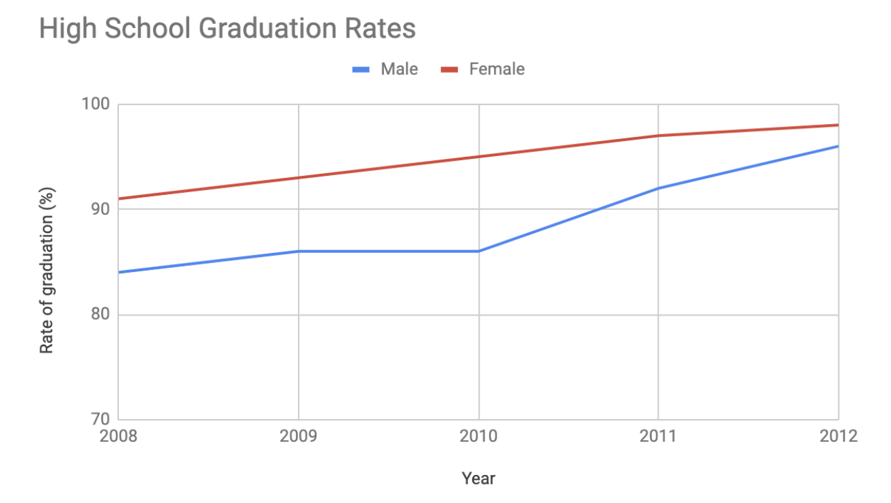
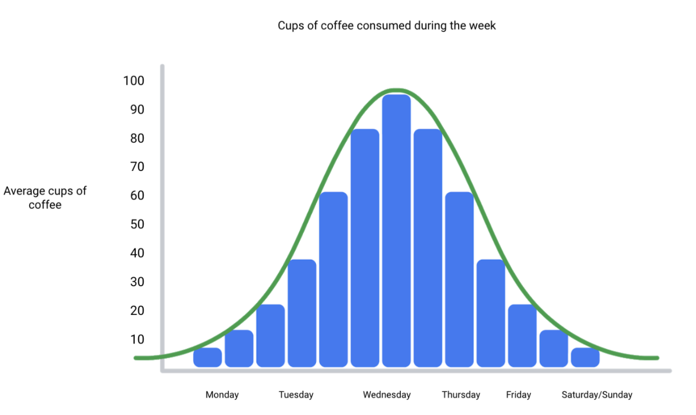

# The wonderful world of visualizations

As a data analyst, you will often be tasked with relaying information and data that your audience might not readily understand. Presenting your data visually is an effective way to communicate complex information and engage your stakeholders. One question to ask yourself is: “what is the best way to tell the story within my data?” This reading includes several options for you to choose from (although there are many more).

&nbsp;

## Line chart 

A **line chart** is used to track changes over short and long periods of time. When smaller changes exist, line charts are better to use than bar graphs. Line charts can also be used to compare changes over the same period of time for more than one group. 

Let’s say you want to present the graduation frequency for a particular high school between the years 2008-2012. You would input your data in a table like this:

| Year | Graduation rate |
| ---- | --------------- |
| 2008 | 87              |
| 2009 | 89              |
| 2010 | 92              |
| 2011 | 92              |
| 2012 | 96              |

From this table, you are able to present your data in a line chart like this:

Maybe your data is more specific than above. For example, let’s say you are tasked with presenting the difference of graduation rates between male and female students. Then your chart would resemble something like this:

&nbsp;

## Column chart 

**Column charts** use size to contrast and compare two or more values, using height or lengths to represent the specific values.  

The below is example data concerning sales of vehicles over the course of 5 months:

| Month     | Vehicles sold |
| --------- | ------------- |
| August    | 2,800         |
| September | 3,700         |
| October   | 3,750         |
| November  | 4,300         |
| December  | 4,600         |

Visually, it would resemble something like this:

What would this column chart entail if we wanted to add the sales data for a competing car brand?

&nbsp;

## Heatmap 

Similar to bar charts, **heatmaps** also use color to compare categories in a data set. They are mainly used to show relationships between two variables and use a system of color-coding to represent different values. The following heatmap plots temperature changes for each city during the hottest and coldest months of the year.

&nbsp;

## Pie chart

The **pie chart** is a circular graph that is divided into segments representing proportions corresponding to the quantity it represents, especially when dealing with parts of a whole.

For example, let’s say you are determining favorite movie categories among avid movie watchers. You have gathered the following data:

| Movie category | Preference |
| -------------- | ---------- |
| Comedy         | 41%        |
| Drama          | 11%        |
| Sci-fi          | 3%         |
| Romance        | 17%        |
| Action         | 28%        |

Visually, it would resemble something like this:

&nbsp;

## Scatter plot

**Scatter plots** show relationships between different variables. Scatter plots are typically used for two variables for a set of data, although additional variables can be displayed.

For example, you might want to show data of the relationship between temperature changes and ice cream sales. It would resemble something like this:

&nbsp;

## Distribution graph

A **distribution graph** displays the spread of various outcomes in a dataset. 

Let’s apply this to real data. To account for its supplies, a brand new coffee shop owner wants to measure how many cups of coffee their customers consume, and they want to know if that information is dependent on the days and times of the week. That distribution graph would resemble something like this:

From this distribution graph, you may notice that the amount of coffee sales steadily increases from the beginning of the week, reaching the highest point mid-week, and then decreases towards the end of the week.

If outcomes are categorized on the x-axis by distinct numeric values (or ranges of numeric values), the distribution becomes a **histogram**. If data is collected from a customer rewards program, they could categorize how many customers consume between one and ten cups of coffee per week. The histogram would have ten columns representing the number of cups, and the height of the columns would indicate the number of customers drinking that many cups of coffee per week.

Reviewing each of these visual examples, where do you notice that they fit in relation to your type of data? One way to answer this is by evaluating patterns in data. Meaningful patterns can take many forms, such as:

* **Change:** This is a trend or instance of observations that become different over time. A great way to measure change in data is through a line or column chart.
* **Clustering:** A collection of data points with similar or different values. This is best represented through a distribution graph.
* **Relativity:** These are observations considered in relation or in proportion to something else. You have probably seen examples of relativity data in a pie chart.
* **Ranking:** This is a position in a scale of achievement or status. Data that requires ranking is best represented by a column chart.
* **Correlation:** This shows a mutual relationship or connection between two or more things. A scatter plot is an excellent way to represent this type of data pattern.

&nbsp;

## Studying your data

Data analysts are tasked with collecting and interpreting data as well as displaying data in a meaningful and digestible way. Determining how to visualize your data will require studying your data’s patterns and converting it using visual cues. Feel free to practice your own charts and data in spreadsheets. Simply input your data in the spreadsheet, highlight it, then insert any chart type and view how your data can be visualized based on what you choose.
