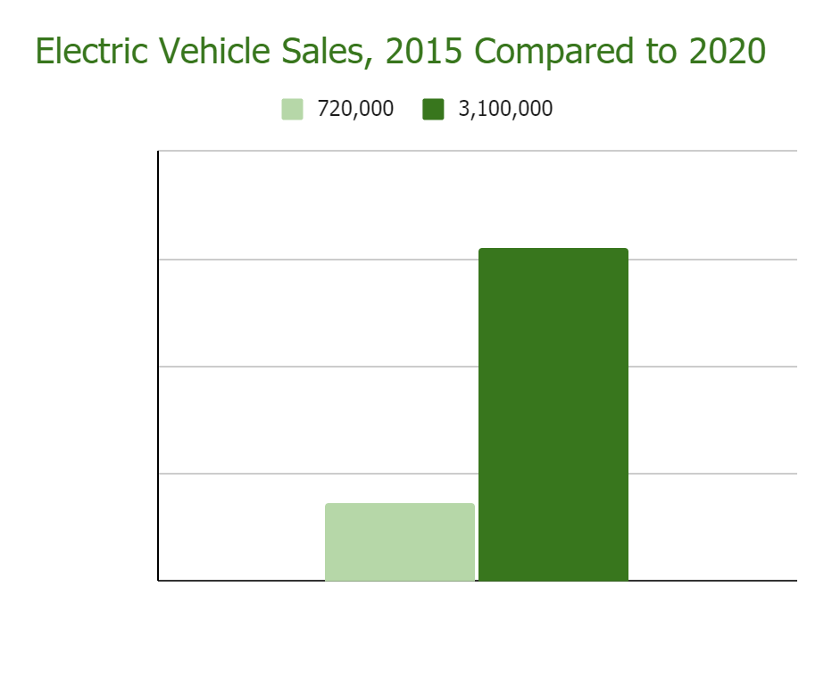
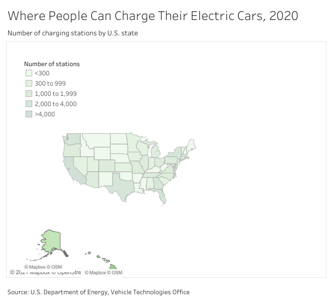
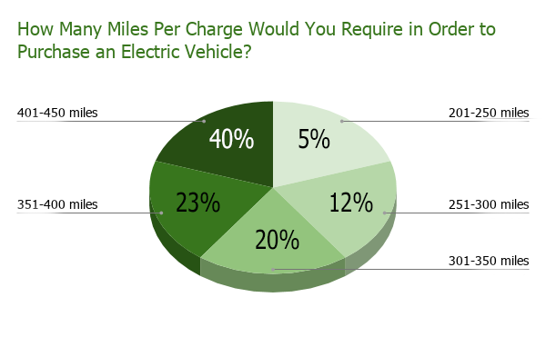
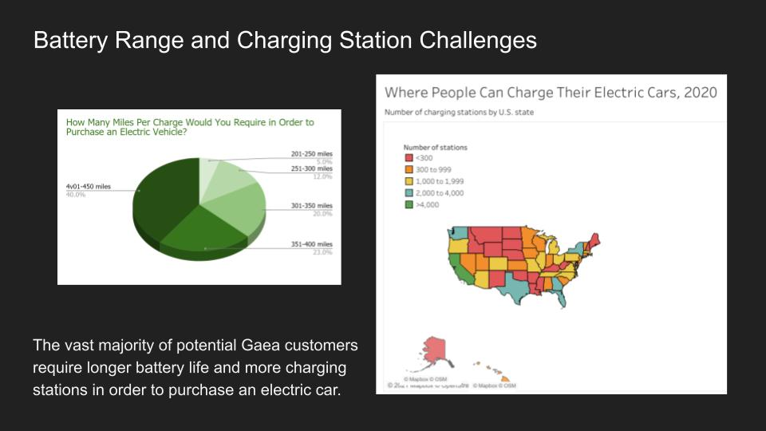

## Course challenge

Latest Submission Grade: 100%

&nbsp;

## Scenario 1, questions 1-9

### Question 1

You have been working as a junior data analyst at Bowling Green Business Intelligence for nearly a year. Your supervisor, Kate, tells you that she believes you are ready for more responsibility. She asks you to lead an upcoming client presentation. You will be responsible for creating the data story, identifying the right tools to use, building the slideshow, and delivering the presentation to stakeholders.

Your client is Gaea, an automotive manufacturer that makes eco-friendly electric cars. For the past year, you have been working with the data team in Gaea’s Bowling Green, Kentucky, headquarters. For the presentation, you will engage the data team, as well as its regional sales representatives and distributors. Your presentation will inform their business strategy for the next three-to-five years.

You begin by getting together with your team to discuss the data story you want to tell. You know the first step in data storytelling is to engage your audience. 

**You use spotlighting to help you identify the most important insights. Which of the following activities are involved with spotlighting? Select all that apply.**

* Determining the data’s partiality
* **Noticing repeated words or numbers**
* **Identifying connections or patterns**
* **Finding ideas or concepts that keep arising**

> Spotlighting enables data analysts to identify broad, universal ideas and messages. This may involve identifying connections or patterns, finding ideas or concepts that keep arising, or noticing repeated words or numbers.

&nbsp;

### Question 2

After you identify the most important insights, it’s time to create your primary message. Your team’s analysis has revealed three key insights:

1. Electric vehicle sales demand is expected to grow by more than 400% by 2025.
2. The number of publicly available vehicle charging stations is a significant factor in consumer buying decisions. Currently, there are many locations with so few charging stations that electric car owners would run out of power when traveling between stations. 
3. Vehicle battery range is also a significant factor for consumers. In 2020, the average battery range was 210 miles. However, the vast majority of survey respondents report they will not buy an electric car until the battery range is at least 300 miles per charge.

**Fill in the blank: Based on these insights, you create a clear and direct _____, which will guide your data story.**

* business case
* problem statement
* specific question
* **primary message**

> You create a clear and direct primary message, which will guide your data story. This aligns with best practices for writing a primary message.

&nbsp;

### Question 3

Next, you decide on your data narrative’s characters, setting, plot, big reveal, and aha moment. The characters are the people affected by your story. This includes your stakeholders, Gaea’s customers, and Gaea’s potential future customers. For the setting, you describe the current situation, potential tasks, and background information about the analysis project.

**In which part of your data narrative would you include information about charging stations and the need to increase battery range?**

* Setting
* Big reveal
* Aha moment
* **Plot**

> The plot, or conflict, is used to create tension in the data story. For Gaea’s situation, the plot would include two ideas: An explanation of some of the challenges associated with lack of vehicle charging stations and details about why it’s important for Gaea to increase its cars’ battery range by 2025.

&nbsp;

### Question 4

Now, it’s time to consider which tools to use to create data visualizations that will clearly communicate the results of your analysis. You and your team decide to make both spreadsheet charts and Tableau data visualizations. In addition, you agree to build a dashboard to share live, incoming data with your stakeholders. This will help them achieve the following goals:

* Organize multiple datasets about electric vehicle battery ranges into a central location
* Enable tracking and analysis of electric vehicle data
* Simplify data visualizations about the number of available charging stations using maps of the different geographies 

**Another key benefit of dashboards is that they enable you to maintain control of your data narrative.**

* True
* **False**

> Sharing dashboards with stakeholders likely means that you will lose control of the narrative. This is because you won’t be there to tell the story of your data and share your key message. 

&nbsp;

### Question 5

Now that you have finished planning the data story with your team, it’s time to create data visualizations. First, you consider electric vehicle sales worldwide in 2015 compared to 2020. You use a spreadsheet to create the following bar graph to compare the two values:

**You want to add a label for the years 2015 and 2020. Where on the graph do you label the time periods?**

* The colors
* The vertical bars
* The y-axis
* **The x-axis**

> In bar graphs with vertical bars, the x-axis is used to represent time periods, categories, or other variables. The x-axis is the horizontal line of a bar graph usually placed at the bottom.

&nbsp;

### Question 6

Next, you explore how access to public car-charging stations is influencing electric vehicle purchases. As your analysis has revealed, there are many areas without enough places for people to plug in and charge their cars. This lack of charging stations has a negative impact on demand for electric cars and overall vehicle sales. 

You use Tableau to create the following draft of a visualization, which organizes the charging station data geographically: 

**After reviewing your draft, you realize that it could be improved. To improve your draft, you select more varied hues, choose darker values, and make the color intensity stronger. This will also help clarify the spacing between the states.**

* **True**
* False

> A map’s colors should be used to help the audience understand the data it contains. Stronger color intensity will help to brighten the colors and clarify the spacing between the states. 

&nbsp;

### Question 7

Now, you want to highlight what your team’s analysis discovered about the number of charging stations available compared to the number of cars purchased. Your data has confirmed that the lack of charging stations causes the effect of fewer car sales. To communicate this effectively, you will need to convey causation to the stakeholders.

**How do you explain causation?**

* Causation involves how often data values fall into certain ranges. In the case of Gaea’s business, data about the number of charging stations will fall into ranges associated with car sales
* Causation is the measure of the degree to which two variables move in relationship to each other. In the case of Gaea’s business, charging station numbers and car sales move in the same direction
* Causation involves everything associated with an event. In the case of Gaea’s business, the lack of charging stations has a negative effect on the entire automotive marketplace
* **Causation is when an action directly leads to an outcome, such as a cause-effect relationship. In the case of Gaea’s business, the lack of charging stations directly leads to the outcome of fewer car sales**

> Causation is when an action directly leads to an outcome, such as a cause-effect relationship. In the case of Gaea’s business, the lack of charging stations directly leads to the outcome of fewer car sales.

&nbsp;

### Question 8

Once you finish creating data visualizations about the current state of the electric vehicle market, you turn to projections for the future. You want to communicate to stakeholders about the importance of longer vehicle battery range to consumers.

Your team’s data includes feedback from a consumer survey that investigated the importance of longer battery when choosing whether to purchase an electric car. The current average battery range is about 210 miles. By 2025, that distance is expected to grow to 450 miles per charge.

You create the following pie chart: 

**After reviewing your pie chart, you realize that it could be improved. How do you make this chart more effective?**

* **Resize the pie segments so they visually show the different values**
* Write a longer title to add more detail about the data the pie chart contains
* Remove the labels for the number of miles per charge consumers will require before purchasing an electric vehicle
* Add an x-axis and y-axis to provide additional explanation about the data

> To make this chart more effective, you resize the pie segments so they visually show the different values. When the segments are all the same size, even though they represent different values, this will confuse the audience.  

&nbsp;

### Question 9

It’s time to build your Tableau dashboard for stakeholders. You consider what type of layout to use.

**You decide that you want to be able to adjust the height of the views and the data visualizations about electric vehicle sales, charging stations, and battery range. Which type of layout will enable you to do that?**

* Circular layout
* Horizontal layout
* **Vertical layout**
* Diagonal layout

> A vertical layout will enable you to adjust the height of the views and objects contained. 

&nbsp;

## Scenario 2, questions 10-15

### Question 10

You have created your narrative and visuals, so now it’s time to build a professional and appealing slideshow. You choose a theme that matches the tone of your presentation. Then, you create a title slide with a title, subtitle, and the date. 

Next, you create the following slide to communicate information about electric vehicle sales in 2015 compared to 2020: 

**To improve the slide, you remove the text box at the bottom. For what reasons will this make your slide more effective? Select all that apply.**

* Slide text should be no more than 10 lines total
* **The text shouldn’t simply repeat the words you say**
* **The font size is too small for your audience to read**
* **Slide text should be fewer than 25 words total**

> Removing the text box at the bottom improves your slide in three ways: First, it eliminates text with a font size that is too small to read. Second, it reduces the slide’s word count to fewer than 25 words. Third, it ensures that the text does not simply repeat the words you say. 

&nbsp;

### Question 11

You then create the following slide to demonstrate the challenges associated with battery range and charging stations:

**After reviewing your slide, you realize that the visual elements could be improved. A good solution would be for you to choose one data visualization to share on this slide, then create another slide for the second data visualization.**

* **True**
* False

> To improve the visual elements, you should choose one data visualization to share on this slide, then create another slide for the second data visualization. titles.

&nbsp;

### Question 12

You complete your slideshow and share it with your team. Once it is approved by your supervisor, you prepare to give your presentation. You consider presentation best practices: maintaining good posture, being aware of nervous habits, and making eye contact. In addition, you think about how you will present your data visualizations.

**What strategies can help you explain the data visualizations effectively? Select all that apply.**

* **Start with the broader ideas**
* **Use the five-second rule**
* Speak quickly to save time and cover all important data points
* **Channel your excitement**

> To make sure you explain the data visualizations effectively, channel your excitement, start with the broader ideas, and use the five-second rule.

&nbsp;

### Question 13

Next, you prepare for the question-and-answer session that will follow your presentation. To predict what questions they may ask, you do a colleague test of your presentation. You should choose a colleague who has deep expertise in the electric vehicle industry.

* True
* **False**

> You choose a colleague who has no previous knowledge of the industry. This will help you confirm that you aren’t making any assumptions or including jargon your audience might not understand.

&nbsp;

### Question 14

Now that you have some idea of the questions the stakeholders will ask, you and a team member consider different objections that might arise. 

**Your team member asks you how you will respond if someone from Gaea questions your data-cleaning process. How do you prepare for this objection? Select all that apply.**

* Be prepared to explain why data cleaning is not relevant at this stage of the project
* **Keep a detailed log of your data-cleaning process**
* **Practice answering questions about your data-cleaning process**
* **Add your data-cleaning log to the slideshow appendix**

> You prepare by keeping a detailed log of your data-cleaning process. Then, you add your data-cleaning log to the slideshow appendix and practice answering questions about your data-cleaning process.

&nbsp;

### Question 15

Scenario 2, continued

The big day has arrived, and you have just finished giving your presentation to the Gaea team. It’s now time for the question-and-answer session, and a stakeholder asks you a very detailed question about one specific electric vehicle charging station initiative. 

**You listen to the whole question, then repeat it. For what reasons is this important? Select all that apply.**

* **It helps you confirm that you understand the question**
* **It gives the stakeholder a chance to correct you if you misunderstand**
* **It ensures the entire audience has heard the question, in case they did not when it was originally asked**
* It enables you to rephrase it in a way that is easier to answer

> Listening to the whole question and repeating it helps you confirm that you understand the question. It also gives the stakeholder a chance to correct you if you misunderstand and ensures the entire audience has heard the question.
