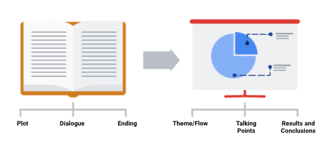
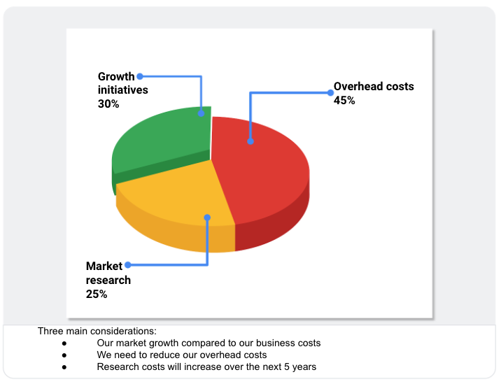

# Guide: Sharing data findings in presentations

&nbsp;

Use this guide to help make your presentation stand out as you tell your data story. Follow the recommended tips and slide sequence in this guide for a presentation that will truly impress your audience. 

You can also [**download this guide as a PDF**](files/Sharing_Your_Data_Findings_In_Presentations.pdf), so you can reference it in the future:

&nbsp;

## Telling your data story (tips and tricks to present your data and results)
Use the following tips and sample layout to build your own presentation. 

### Tip 1: Know your flow

Just like in any good story, a data story must have a good plot (theme and flow), good dialogue (talking points), and a great ending or big reveal (results and conclusions). One flow could be an overview of what was analyzed followed by resulting trends and potential areas for further exploration.

In order to develop the right flow for your presentation, keep your audience in mind. Ask yourself these two questions to help you define the overall flow and build out your presentation. 

**Who is my audience?**

* If your intended audience is executives, board members, directors, or other C-level (C-Suite) executives, your storytelling should be kept at a high level. This audience will want to hear about your story but might not have time to hear the entire story. Executives tend to focus on endings that encourage improving, correcting, or inventing things. Keep your presentation brief and spend most of your time on your results and recommendations. Refer to an upcoming topic in this reading—Tip 3: end with your recommendations.
* If your intended audience is stakeholders and managers, they might have more time to learn about how you performed your analysis and they might ask more data-specific questions. Be prepared with talking points about the aspects of your analysis that led you to your final results and conclusions. 
* If your intended audience is other analysts and individual contributors, you will have the most freedom—and perhaps the most time—to go more deeply into the data, processes, and results. 

**What is the purpose of my presentation?**

* If the goal of your presentation is to request or recommend something at the end, like a sales pitch, you can have each slide work toward the recommendations at the end. 
* If the goal of your presentation is to focus on the results of your analysis, each slide can help mark the path to the results. Be sure to include plenty of breadcrumbs (views of the data analysis steps) to demonstrate the path you took with the data.
* If the goal of your presentation is to provide a report on the data analysis, your slides should clearly summarize your data and key findings. In this case, it is alright to let the data be the star or speak for itself.

&nbsp;

### Tip 2: Prepare talking points and limit text on slides

As you create each slide in your presentation, prepare **talking points** (also called **speaker notes**) on what you will say.

Don’t forget that you will be talking at the same time that your audience is reading your slides. If your slides start becoming more like documents, you should rethink what you will say so that you can remove some text from the slides. Make it easy for your audience to skim read the slides while still paying attention to what you are saying. In general, follow the five-second rule. Your audience should not be spending more than five seconds reading any block of text on a slide.

Knowing exactly what you will say when explaining each slide throughout your presentation also creates a natural flow to your story. Talking points help you avoid awkward pauses between topics. Slides that summarize data can also be repetitive (and boring). If you prepare a variety of interesting talking points about the data, you can keep your audience alert and paying attention to the data and its analysis.

### Tip 3: End with your recommendations

When climbing a mountain, getting to the top is the goal. Making recommendations at the end of your presentation is like getting to the mountaintop. 

* Use one slide for your recommendations at the end. Be clear and concise. 
* If you are recommending that something be done, provide next steps and describe what you would consider a successful outcome.

&nbsp;

### Tip 4: Allow enough time for the presentation and questions

Assume that everyone in your audience is busy. Keep your presentation on topic and as short as possible by:

* Being aware of your timing. This applies to the total number of slides and the time you spend on each slide. 
* Presenting your data efficiently. Make sure that every slide tells a unique and important part of your data story. If a slide isn’t that unique, you might think about combining the information on that slide with another slide.
* Saving enough time for questions at the end or allowing enough time to answer questions throughout your presentation.

&nbsp;

## Putting it all together: Your slide deck layout

In this section, we will describe how to put everything together in a sample slide deck layout.

### First slide: Agenda 

Provide a high-level bulleted list of the topics you will cover and the amount of time you will spend on each. Every company’s norms are different, but in general, most presentations run from 30 minutes to an hour at most. Here is an example of a 30-minute agenda:

* Introductions (4 minutes)
* Project overview and goals (5 minutes)
* Data and analysis (10 minutes)
* Recommendations (3 minutes)
* Actionable steps (3 minutes)
* Questions (5 minutes)

&nbsp;

### Second slide: Purpose

Everyone might not be familiar with your project or know why it is important. They didn’t spend the last couple of weeks thinking about the analysis and results of your project like you did. This slide summarizes the purpose of the project and why it is important to the business for your audience.

Here is an example of a purpose statement:

Service center consolidation is an important cost savings initiative. The aim of this project was to determine the impact of service center consolidation on customer response times. 

&nbsp;

### Third slide: Data/analysis 
First, It really is possible to tell your data story in a single slide if you summarize the key things about your data and analysis. You may have supporting slides with additional data or information in an appendix at the end of the presentation. 

But, if you choose to tell your story using more than one slide, keep the following in mind:

* Slides typically have a logical order (beginning, middle, and end) to fully build the story. 
* Each slide should logically introduce the slide that follows it. Visual cues from the slides or verbal cues from your talking points should let the audience know when you will go on to the next slide. 
* Remember not to use too much text on the slides. When in doubt, refer back to the second tip on preparing talking points and limiting the text on slides. 

The high-level information that people read from the slides shouldn’t be the same as the information you provide in your talking points. There should be a nice balance between the two to tell a good story. You don’t want to simply read or say the words on the slides.

For extra visuals on the slides, use animations. For example, you can:

* Fade in one bullet point at a time as you discuss each on a slide.
* Only display the visual that is relevant to what you are talking about (fade out non-relevant visuals).
* Use arrows or callouts to point to a specific area of a visual that you are using.

&nbsp;

### Fourth slide: Recommendations

If you have been telling your story well in the previous slides, the recommendations will be obvious to your audience. This is when you might get a lot of questions about how your data supports your recommendations. Be ready to communicate how your data backs up your conclusion or recommendations in different ways. Having multiple words to state the same thing also helps if someone is having difficulty with one particular explanation.

&nbsp;

### Fifth slide: Call to action

Sometimes the call to action can be combined with the recommendations slide. If there are multiple actions or activities recommended, a separate slide is best. 

Recall our example of a purpose statement: 
Service center consolidation is an important cost savings initiative. The aim of this project was to determine the impact of service center consolidation on customer response times. 

Suppose the data analysis showed that service center consolidation negatively impacted customer response times. A call to action might be to examine if processes need to change to bring customer response times back to what they were before the consolidation.

&nbsp;

## Wrapping it up: Getting feedback 

After you present to your audience, think about how you told your data story and how you can get feedback for improvement. Consider asking your manager or another data analyst for candid thoughts about your storytelling and presentation overall. Feedback is great to help you improve. When you have to write a brand new data story (or a sequel to the one you already told), you will be ready to impress your audience even more!
