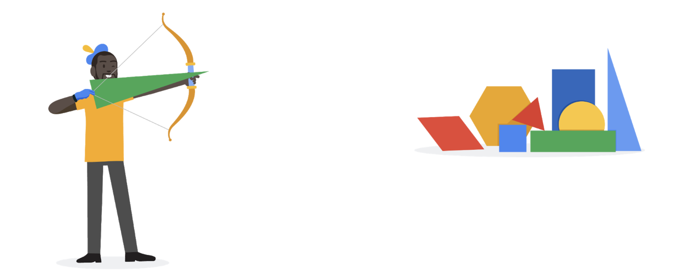

# Drawing arrows and shapes in R

Annotations are a useful way to add notes to your plot. They help you explain the plot’s purpose, highlight important data points, or comment on any data trends or findings the plot illustrates. You have already learned how to add notes as labels, titles, subtitles, and captions. You can also draw arrows or add shapes to your plot to create more emphasis. Usually you add these kinds of annotations in your presentation application after you have saved the visualizations. But, you can now add lines, arrows, and shapes to your plots using **ggplot2**.

&nbsp;

## Resources

Check out these resources to learn more:

* [Create an annotation layer](https://ggplot2.tidyverse.org/reference/annotate.html): This guide explains how to add an annotation layer with ggplot2. It includes sample code and data visualizations with annotations created in ggplot2. 
* [How to annotate a plot in ggplot2](https://www.r-graph-gallery.com/233-add-annotations-on-ggplot2-chart.html): This resource includes explanations about how to add different kinds of annotations to your ggplot2 plots, and is a great reference if you need to quickly look up a specific kind of annotation. 
* [Annotations](https://ggplot2-book.org/annotations.html): Chapter eight of the online ggplot2 textbook is focused entirely on annotations. It provides in-depth explanations of the different types of annotations, how they are used, and detailed examples. 
* [How to annotate a plot](https://www.r-bloggers.com/2017/02/how-to-annotate-a-plot-in-ggplot2/): This R-Bloggers article includes explanations about how to annotate plots in ggplot2. It starts with basic concepts and covers more complicated information the further on you read. 
* [Text Annotations](https://viz-ggplot2.rsquaredacademy.com/textann.html): This resource focuses specifically on adding text annotations and labels to ggplot2 visualizations. 
