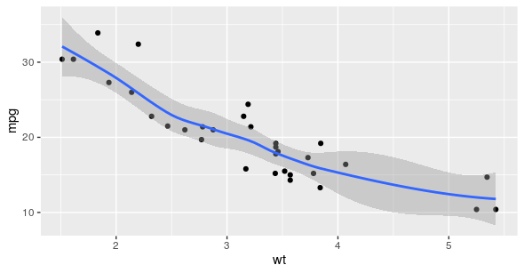

# Smoothing

In this reading, you will learn about smoothing in ggplot2 and how it can be used to make your data visualizations in R clearer and easier to follow. Sometimes it can be hard to understand trends in your data from scatter plots alone. **Smoothing** enables the detection of a data trend even when you can't easily notice a trend from the plotted data points. Ggplot2’s smoothing functionality is helpful because it adds a smoothing line as another layer to a plot; the **smoothing line** helps the data to make sense to a casual observer.

**Example code**

```
ggplot(data, aes(x=distance, 
y= dep_delay)) +
    geom_point() +
    geom_smooth()
```


T​he example code creates a plot with a trend line similar to the blue line below.


## Two types of smoothing


<table>
<tr>
<td> Type of smoothing </td> <td> Description </td> <td> Example code</td>
</tr>
<tr>
<td> Loess smoothing </td>
<td>

The loess smoothing process is best for smoothing 
plots with less than 1000 points.

</td>
<td>

```
ggplot(data, aes(x=, y=))+ 
  geom_point() +       
  geom_smooth(method="loess")
```
</td>


</tr>
<tr>
<td> Gam smoothing </td>
<td>

Gam smoothing, or generalized additive model 
smoothing, is useful for smoothing plots with a large
number of points. 

</td>
<td>

```
ggplot(data, aes(x=, y=)) + 
  geom_point() +        
  geom_smooth(method="gam", 
formula = y ~s(x))
```
</td>
</tr>
</table>


The smoothing functionality in ggplot2 helps make data plots more readable, so you are better able to recognize data trends and make key insights. The first plot below is the data before smoothing, and the second plot below is the same data after smoothing.




## Additional resource

F​or more information about smoothing, refer to the Smoothing section in the [Stats Education’s Introduction to R](http://statseducation.com/Introduction-to-R/modules/graphics/smoothing/) course. It includes detailed descriptions and examples of how to use the different types of smoothing in ggplot2. It also includes links to other lessons about ggplot2. You can explore these to get more familiar with plotting data in R. 
