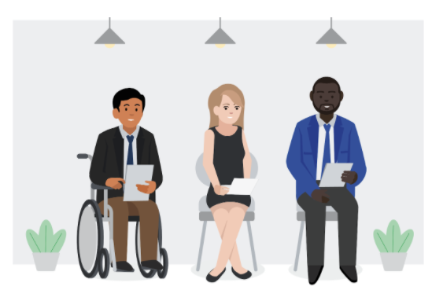

# Scenario video series introduction

Data analytics is an exciting field that can involve tons of different industries and specializations. As a trained data analyst, you will have a wide variety of opportunities to choose from. Before you get there, though, there is still one last part of your career journey that you have to master: the interview process. 

Potential interviewers will ask you lots of different types of questions to ensure that you are both a great technical fit for the job, and an overall personable and professional person. The following videos will guide you through different scenarios you might come across during a typical job interview. In these scenarios, you will meet the job applicant, Sally, a recently certified data analyst, and Jordan, the head of human resources. Sally applied to a job at BWR Technical Services and was asked to participate in an interview. 

To use the template for the job application posting, click the link below and select “Use Template.” 

Link to template: [Job application posting](https://docs.google.com/document/d/1wJh2mlh-baGQw0i6Uh_up-yQmq9EvibyFSK3mTmb0JE/template/preview)

Or, If you don’t have a Google account, you can download the file directly from the attachment below.

[Junior Data Analyst Job Application](files/Junior_Data_Analyst_Job_Application.docx)

1. **Introduction**: The purpose of this video is for Jordan to get to know Sally and gain insight into her personality and background. This is the part of the interview when the interviewer usually answers questions about the company and the position. It’s also an opportunity for the applicant to outline how the skills they used in past roles can translate into the position they are applying for. 

2. **Case study**: In this video, Sally is tasked with solving an assigned challenge where she has to outline her thinking, ask key questions, recommend solutions, and more. 

To use the template for the case study presentation, click the link below and select “Use Template.” 

Link to template: [Case study presentation example](https://docs.google.com/presentation/d/1sGM5w0zbf_5HS2aiTLFZEaVfIfn0Yea8zkQ5O5eTIfc/template/preview)  

Or, If you don’t have a Google account, you can download the file directly from the attachment below.

[Bridging the Communication Gap between Teachers & Parents](files/Bridging_the_Communication_Gap_between_Teachers&Parents.pptx)

3. **Solving problems**: Most interviewers will ask applicants questions related to their problem-solving abilities. In this video, Sally provides specific examples of past challenges and how she used her problem-solving skills to overcome them.

4. **Salary negotiation**: Once the interviews are over, if the company offers you the position, you and the company both need to agree on your starting salary. Although it is often an uncomfortable part of the process for many job applicants, negotiating a salary that you feel is fair is very important. This video highlights how Sally has done her research and didn’t feel pressured to accept the company’s first offer on the spot.

When it comes to job interviews, there is no such thing as being too prepared. Be sure to do your research on the company, the role you are applying to, and salary expectations for the position. Practice marketing yourself and your skills and use active listening whenever you are asking and answering questions. 
