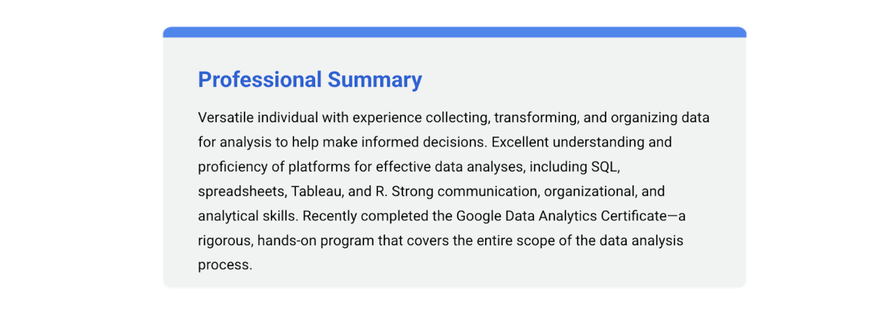

# Showcase your work

Congratulations on earning your Google Data Analytics Certificate! Now it’s time to let the world know about the skills you gained to help advance your career and share some of the artifacts you created along the way. We recommend adding the completion of this certificate to your resume and LinkedIn profile. Read on and follow these tips to get started.

&nbsp;

## Adding the Google Data Analytics Certificate to your resume and LinkedIn profile

You may have already started on a data analyst resume earlier in the certificate. If not, there are a variety of digital templates for creating your resume available at Enhancv, Big Interview, Google Docs or Microsoft Word. You can find additional resume creation guidance in this lesson from Applied Digital Skills: Start a Resume

&nbsp;

### Update your Education or Licenses and Certifications section

* To add the completion of this certificate to your resume, update your Education or Licenses & Certifications section.
* To add the completion of this certificate to the Licenses & Certifications section of your LinkedIn profile, follow the steps listed in this article.  

&nbsp;

### Update your Skills section

* If applicable, update the Skills section of your resume. Below is a comprehensive list of skills that this certificate was designed to help you develop that you could potentially add.
* To update the Skills & Endorsements section of your LinkedIn profile, follow the steps listed in this article. 

&nbsp;

### Update your Summary or About section
If you have a Summary section in your resume, you can include this certification as a qualification.

To include a summary that mentions this certification in your LinkedIn profile, update your About section by following the steps listed in this article.

